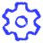

# SVG-иконки сайта IT TIME NOW

**Статус внедрения:** новая серия подключена на страницах сайта через `UiIcon`
и в HTML-эталоне дизайн-системы. Рабочие PNG находятся в [public/icons](../public/icons/),
реестр — в [src/data/icons.ts](../src/data/icons.ts). Для новых страниц действуют
[правила серии](icon-style-guide.md) и [итоговый промпт](prompts/sketch-icon.txt).
Колонки старых SVG и ссылки на строки исходников ниже сохраняют снимок до замены;
нумерация строк после внедрения могла измениться.

Дата: 22 сентября 2026 года. Источник: текущее рабочее дерево проекта, включая локальные изменения. Это инвентаризация исходников, без сверки с опубликованной версией сайта.

Проверены **43 страницы**: главная, каталог, 12 страниц услуг, раздел кейсов и 17 кейсов, блог и 4 опубликованные статьи, страница компании, 2 оферты, ошибка 404 и 2 страницы дизайн-системы. Найдено **20 используемых иконок `UiIcon` и 17 дополнительных рисунков/вариантов inline SVG**. Ниже — **375 контекстных записей** с описанием роли иконки в конкретном блоке.

Одна строка соответствует иконке в блоке или карточке. Повторения с одинаковой ролью внутри одного списка или FAQ объединены; разные карточки и страницы описаны отдельно. Размер, цвет и CSS-состояние одного рисунка не создают новую иконку. Отличающиеся контуры и viewBox перечислены отдельно; два варианта толщины одного шеврона 16×16 объединены.

Названия встроенных SVG (`arrow-16`, `monitor-48` и другие) — идентификаторы этого отчёта: в исходниках отдельного имени компонента у них нет. Описания объясняют фактическое соседство с текстом блока; это не рекомендации по замене иконок.

SVG-логотипы, favicon и декоративная схема вынесены отдельно. Изображения PNG/WebP, текстовые стрелки и плюсы, CSS-маркеры не являются SVG-иконками. Содержимое внешней формы Bitrix24, создаваемое сторонним скриптом во время работы браузера, не входит в доступные исходники и здесь не инвентаризировано.

Превью добавлены к каждой строке каталога и использования. Контуры и толщина линий взяты из исходников; для сравнения рисунки показаны синим на светлой подложке в размере 48×48 px. Вложенный SVG сохраняет исходный viewBox. У шеврона 16×16 показаны оба варианта толщины (1,8 и 1,7); в строках использования выбран соответствующий вариант. Файлы превью находятся в [assets/svg-icons](assets/svg-icons/).

Рядом с каждой исходной SVG добавлена новая растровая иконка: **37 PNG, 512×512 px, прозрачный фон, один цвет `#323BFF`**. Вся серия обновлена по последнему одобренному образцу: жирный ручной штрих, заметно кривые линии, чередование плотных утолщений и тонких сухих участков, шероховатые края и неровные окончания. Общий визуальный вес согласован с [утверждённым bar-chart](assets/sketch-icons/examples/bar-chart-bold-pressure.png); локальная толщина намеренно меняется вместе с нажимом. Длинная сторона рисунка занимает около 472 px, минимальное поле — около 20 px. Программная обработка задаёт только цвет, размер и поля, сохраняя рисунок штриха. В таблицах слева — старая SVG, справа — новая иконка, обе в 48×48 px. Используются обычные Markdown-превью без HTML-тегов; нажатие на новую иконку открывает PNG 512×512. Все файлы — в [assets/sketch-icons](assets/sketch-icons/).

## Каталог уникальных иконок

### Общий набор `UiIcon`

До замены все 20 значков были определены в `UiIcon.astro` как SVG: `viewBox="0 0 24 24"`, `fill="none"`, `stroke="currentColor"`, `stroke-width="2"`, скруглённые концы и соединения. Теперь [UiIcon.astro](../src/components/UiIcon.astro) выводит утверждённые PNG из общего реестра. Все 20 имён сохраняются и используются в страницах.

| Старая иконка (SVG) | Новая иконка (скетч) | Иконка | Что изображено | Контексты использования |
| --- | --- | --- | --- | --- |
|  | [](assets/sketch-icons/arrow.png) | `arrow` | Стрелка вправо | [Общие элементы сайта](#common), [Главная](#home), [Каталог услуг](#services), [Внедрение Bitrix24](#bitrix24), [Внедрение РосБизнесСофт](#rbs), [Внедрение ELMA365](#elma), [Техническая поддержка](#support), [Разработка сайтов](#sites), [Разработка веб-сервисов](#web-services), [Интеграции систем](#integrations), [ИИ для бизнеса](#ai), [ИИ-консультант для сайта и мессенджеров](#consultants), [ИИ-ассистент для отдела продаж](#sales-assistants), [Корпоративная база знаний с ИИ-поиском](#knowledge-bases), [Автоматизация рутинных процессов с ИИ](#routine-automation) |
|  | [](assets/sketch-icons/bar-chart.png) | `bar-chart` | Столбчатая диаграмма | [Внедрение Bitrix24](#bitrix24), [Внедрение РосБизнесСофт](#rbs), [Внедрение ELMA365](#elma), [Техническая поддержка](#support), [Разработка сайтов](#sites), [Интеграции систем](#integrations), [ИИ для бизнеса](#ai), [ИИ-консультант для сайта и мессенджеров](#consultants), [ИИ-ассистент для отдела продаж](#sales-assistants), [Корпоративная база знаний с ИИ-поиском](#knowledge-bases), [Автоматизация рутинных процессов с ИИ](#routine-automation) |
|  | [](assets/sketch-icons/briefcase.png) | `briefcase` | Портфель | [Каталог услуг](#services), [Внедрение Bitrix24](#bitrix24), [Внедрение РосБизнесСофт](#rbs), [Внедрение ELMA365](#elma), [Техническая поддержка](#support), [Разработка сайтов](#sites), [ИИ для бизнеса](#ai), [ИИ-консультант для сайта и мессенджеров](#consultants), [ИИ-ассистент для отдела продаж](#sales-assistants), [Корпоративная база знаний с ИИ-поиском](#knowledge-bases), [Автоматизация рутинных процессов с ИИ](#routine-automation) |
|  | [](assets/sketch-icons/check.png) | `check` | Галочка | [Каталог услуг](#services), [Техническая поддержка](#support), [Разработка сайтов](#sites), [Разработка веб-сервисов](#web-services), [ИИ для бизнеса](#ai), [ИИ-консультант для сайта и мессенджеров](#consultants), [ИИ-ассистент для отдела продаж](#sales-assistants), [Корпоративная база знаний с ИИ-поиском](#knowledge-bases), [Автоматизация рутинных процессов с ИИ](#routine-automation) |
|  | [](assets/sketch-icons/chevron.png) | `chevron` | Шеврон вправо | [Внедрение Bitrix24](#bitrix24), [Внедрение РосБизнесСофт](#rbs), [Внедрение ELMA365](#elma), [Техническая поддержка](#support), [Разработка сайтов](#sites), [Разработка веб-сервисов](#web-services), [Интеграции систем](#integrations), [ИИ для бизнеса](#ai), [ИИ-консультант для сайта и мессенджеров](#consultants), [ИИ-ассистент для отдела продаж](#sales-assistants), [Корпоративная база знаний с ИИ-поиском](#knowledge-bases), [Автоматизация рутинных процессов с ИИ](#routine-automation) |
|  | [](assets/sketch-icons/cloud.png) | `cloud` | Облако | [Техническая поддержка](#support), [ИИ для бизнеса](#ai) |
|  | [](assets/sketch-icons/database.png) | `database` | Цилиндр базы данных | [Каталог услуг](#services), [Внедрение Bitrix24](#bitrix24), [Внедрение РосБизнесСофт](#rbs), [Внедрение ELMA365](#elma), [Техническая поддержка](#support), [Разработка сайтов](#sites), [Разработка веб-сервисов](#web-services), [Интеграции систем](#integrations), [ИИ для бизнеса](#ai), [ИИ-консультант для сайта и мессенджеров](#consultants), [ИИ-ассистент для отдела продаж](#sales-assistants), [Корпоративная база знаний с ИИ-поиском](#knowledge-bases), [Автоматизация рутинных процессов с ИИ](#routine-automation) |
|  | [](assets/sketch-icons/file.png) | `file` | Документ с загнутым уголком | [Внедрение Bitrix24](#bitrix24), [Внедрение РосБизнесСофт](#rbs), [Внедрение ELMA365](#elma), [Техническая поддержка](#support), [Разработка веб-сервисов](#web-services), [Интеграции систем](#integrations), [ИИ для бизнеса](#ai), [ИИ-консультант для сайта и мессенджеров](#consultants), [ИИ-ассистент для отдела продаж](#sales-assistants), [Корпоративная база знаний с ИИ-поиском](#knowledge-bases), [Автоматизация рутинных процессов с ИИ](#routine-automation) |
|  | [](assets/sketch-icons/filter.png) | `filter` | Воронка | [Внедрение Bitrix24](#bitrix24), [Внедрение РосБизнесСофт](#rbs), [Техническая поддержка](#support), [Разработка сайтов](#sites), [Разработка веб-сервисов](#web-services), [Интеграции систем](#integrations) |
|  | [](assets/sketch-icons/layers.png) | `layers` | Три слоя | [Каталог услуг](#services), [Внедрение Bitrix24](#bitrix24), [Внедрение РосБизнесСофт](#rbs), [Внедрение ELMA365](#elma), [Техническая поддержка](#support), [Разработка сайтов](#sites), [Разработка веб-сервисов](#web-services), [Интеграции систем](#integrations) |
|  | [](assets/sketch-icons/lock.png) | `lock` | Закрытый замок | [Техническая поддержка](#support), [ИИ для бизнеса](#ai), [ИИ-консультант для сайта и мессенджеров](#consultants), [ИИ-ассистент для отдела продаж](#sales-assistants), [Корпоративная база знаний с ИИ-поиском](#knowledge-bases), [Автоматизация рутинных процессов с ИИ](#routine-automation) |
|  | [](assets/sketch-icons/message.png) | `message` | Диалоговое облако | [Каталог услуг](#services), [Внедрение Bitrix24](#bitrix24), [Внедрение ELMA365](#elma), [Техническая поддержка](#support), [Разработка сайтов](#sites), [Разработка веб-сервисов](#web-services), [Интеграции систем](#integrations), [ИИ для бизнеса](#ai), [ИИ-консультант для сайта и мессенджеров](#consultants), [ИИ-ассистент для отдела продаж](#sales-assistants), [Корпоративная база знаний с ИИ-поиском](#knowledge-bases), [Автоматизация рутинных процессов с ИИ](#routine-automation) |
|  | [](assets/sketch-icons/phone.png) | `phone` | Телефонная трубка | [Общие элементы сайта](#common), [Внедрение Bitrix24](#bitrix24), [Внедрение РосБизнесСофт](#rbs), [Разработка сайтов](#sites), [Интеграции систем](#integrations) |
|  | [](assets/sketch-icons/rocket.png) | `rocket` | Ракета | [Внедрение Bitrix24](#bitrix24), [Внедрение РосБизнесСофт](#rbs), [Внедрение ELMA365](#elma), [Разработка сайтов](#sites), [Разработка веб-сервисов](#web-services) |
|  | [](assets/sketch-icons/settings.png) | `settings` | Шестерёнка | [Внедрение Bitrix24](#bitrix24), [Внедрение РосБизнесСофт](#rbs), [Внедрение ELMA365](#elma), [Техническая поддержка](#support), [Разработка сайтов](#sites), [Разработка веб-сервисов](#web-services), [Интеграции систем](#integrations), [ИИ для бизнеса](#ai), [Корпоративная база знаний с ИИ-поиском](#knowledge-bases) |
|  | [](assets/sketch-icons/shield.png) | `shield` | Щит с галочкой | [Внедрение Bitrix24](#bitrix24), [Внедрение ELMA365](#elma), [Техническая поддержка](#support), [Разработка сайтов](#sites), [Интеграции систем](#integrations), [ИИ для бизнеса](#ai), [ИИ-консультант для сайта и мессенджеров](#consultants), [ИИ-ассистент для отдела продаж](#sales-assistants), [Корпоративная база знаний с ИИ-поиском](#knowledge-bases), [Автоматизация рутинных процессов с ИИ](#routine-automation) |
|  | [](assets/sketch-icons/spark.png) | `spark` | Две искры | [Внедрение ELMA365](#elma), [Техническая поддержка](#support), [Разработка сайтов](#sites), [Разработка веб-сервисов](#web-services), [ИИ для бизнеса](#ai), [Корпоративная база знаний с ИИ-поиском](#knowledge-bases) |
|  | [](assets/sketch-icons/thumbs-up.png) | `thumbs-up` | Большой палец вверх | [Внедрение Bitrix24](#bitrix24), [Внедрение РосБизнесСофт](#rbs) |
|  | [](assets/sketch-icons/users.png) | `users` | Группа людей | [Внедрение Bitrix24](#bitrix24), [Внедрение РосБизнесСофт](#rbs), [Внедрение ELMA365](#elma), [Техническая поддержка](#support), [Разработка веб-сервисов](#web-services), [ИИ для бизнеса](#ai), [ИИ-консультант для сайта и мессенджеров](#consultants), [Корпоративная база знаний с ИИ-поиском](#knowledge-bases) |
|  | [](assets/sketch-icons/workflow.png) | `workflow` | Связанные узлы процесса | [Каталог услуг](#services), [Внедрение Bitrix24](#bitrix24), [Внедрение РосБизнесСофт](#rbs), [Внедрение ELMA365](#elma), [Техническая поддержка](#support), [Разработка сайтов](#sites), [Разработка веб-сервисов](#web-services), [Интеграции систем](#integrations), [ИИ для бизнеса](#ai), [ИИ-консультант для сайта и мессенджеров](#consultants), [ИИ-ассистент для отдела продаж](#sales-assistants), [Корпоративная база знаний с ИИ-поиском](#knowledge-bases), [Автоматизация рутинных процессов с ИИ](#routine-automation) |

### Встроенные SVG с другими контурами

| Старая иконка (SVG) | Новая иконка (скетч) | ID в отчёте | Что изображено | Контексты | Первый источник |
| --- | --- | --- | --- | --- | --- |
|  | [](assets/sketch-icons/nav-down-12.png) | `nav-down-12` | Шеврон вниз · viewBox 12×12 | [Общие элементы сайта](#common) | [Header.astro:70](../src/components/Header.astro#L70) |
|  | [](assets/sketch-icons/menu-24.png) | `menu-24` | Три горизонтальные линии · 24×24 | [Общие элементы сайта](#common) | [Header.astro:189](../src/components/Header.astro#L189) |
|  | [](assets/sketch-icons/arrow-alt-24.png) | `arrow-alt-24` | Стрелка вправо, отдельный контур · 24×24 | [Страница ошибки 404](#404), [Дизайн-система](#design-system) | [404.astro:59](../src/pages/404.astro#L59) |
|  | [](assets/sketch-icons/arrow-up-right-24.png) | `arrow-up-right-24` | Стрелка вправо-вверх · 24×24 | [Страница ошибки 404](#404) | [404.astro:84](../src/pages/404.astro#L84) |
|  | [](assets/sketch-icons/arrow-16.png) | `arrow-16` | Стрелка вправо · 16×16 | [Глобальные стили](#global-styles), [Дизайн-система](#design-system) | [global-styles.astro:47](../src/pages/global-styles.astro#L47) |
|  | [](assets/sketch-icons/briefcase-16.png) | `briefcase-16` | Портфель · 16×16 | [Дизайн-система](#design-system) | [design-system.html:447](../temp/design_system-ittn-v2/design-system.html#L447) |
|  | [](assets/sketch-icons/message-16.png) | `message-16` | Диалоговое облако · 16×16 | [Дизайн-система](#design-system) | [design-system.html:448](../temp/design_system-ittn-v2/design-system.html#L448) |
|   | [](assets/sketch-icons/chevron-16.png) | `chevron-16` | Шеврон вправо · 16×16; stroke-width 1,7 и 1,8 | [Дизайн-система](#design-system) | [design-system.html:449](../temp/design_system-ittn-v2/design-system.html#L449) |
|  | [](assets/sketch-icons/filter-16.png) | `filter-16` | Три сужающиеся полосы фильтра · 16×16 | [Дизайн-система](#design-system) | [design-system.html:456](../temp/design_system-ittn-v2/design-system.html#L456) |
|  | [](assets/sketch-icons/layers-16.png) | `layers-16` | Три слоя · 16×16 | [Дизайн-система](#design-system) | [design-system.html:457](../temp/design_system-ittn-v2/design-system.html#L457) |
|  | [](assets/sketch-icons/settings-16.png) | `settings-16` | Круг с лучами, настройки · 16×16 | [Дизайн-система](#design-system) | [design-system.html:458](../temp/design_system-ittn-v2/design-system.html#L458) |
|  | [](assets/sketch-icons/monitor-48.png) | `monitor-48` | Монитор с окном браузера · 48×48 | [Дизайн-система](#design-system) | [design-system.html:521](../temp/design_system-ittn-v2/design-system.html#L521) |
|  | [](assets/sketch-icons/grid-48.png) | `grid-48` | Сетка из четырёх модулей · 48×48 | [Дизайн-система](#design-system) | [design-system.html:529](../temp/design_system-ittn-v2/design-system.html#L529) |
|  | [](assets/sketch-icons/cube-48.png) | `cube-48` | Объёмный куб · 48×48 | [Дизайн-система](#design-system) | [design-system.html:537](../temp/design_system-ittn-v2/design-system.html#L537) |
|  | [](assets/sketch-icons/workflow-48.png) | `workflow-48` | Блок-схема · 48×48 | [Дизайн-система](#design-system) | [design-system.html:545](../temp/design_system-ittn-v2/design-system.html#L545) |
|  | [](assets/sketch-icons/chip-48.png) | `chip-48` | Микрочип · 48×48 | [Дизайн-система](#design-system) | [design-system.html:553](../temp/design_system-ittn-v2/design-system.html#L553) |
|  | [](assets/sketch-icons/headset-48.png) | `headset-48` | Гарнитура поддержки · 48×48 | [Дизайн-система](#design-system) | [design-system.html:561](../temp/design_system-ittn-v2/design-system.html#L561) |

## Использование по страницам и блокам

<a id="common"></a>

### Общие элементы сайта

**Страница:** `Все 43 страницы; условия указаны в строках`.

| Старая иконка (SVG) | Новая иконка (скетч) | Иконка | Блок / карточка / действие | Описание относительно текста блока | Источник |
| --- | --- | --- | --- | --- | --- |
|  | [](assets/sketch-icons/nav-down-12.png) | `nav-down-12` | Шапка → «Услуги», desktop | Шеврон вниз обозначает выпадающее меню направлений. На странице каталога выводится в текущем пункте, на остальных — в ссылке; это альтернативные ветки одного значка. | [Header.astro:70](../src/components/Header.astro#L70); [Header.astro:81](../src/components/Header.astro#L81) |
|  | [](assets/sketch-icons/arrow.png) | `arrow` | Шапка → «Техническая поддержка» в меню услуг | Предлагает перейти к поддержке и развитию сайтов, CRM, ERP и интеграций. На самой странице поддержки ссылка заменяется текущим пунктом без стрелки. | [Header.astro:151](../src/components/Header.astro#L151) |
|  | [](assets/sketch-icons/phone.png) | `phone` | Шапка → «Бесплатная консультация», от 1024 px | Телефонная трубка обозначает связь со специалистом. Кнопка открывает форму консультации. | [Header.astro:176](../src/components/Header.astro#L176) |
|  | [](assets/sketch-icons/menu-24.png) | `menu-24` | Шапка → мобильная кнопка «Меню», до 768 px | Три горизонтальные линии обозначают открытие и закрытие навигации по услугам, кейсам, блогу и компании. | [Header.astro:189](../src/components/Header.astro#L189) |
|  | [](assets/sketch-icons/phone.png) | `phone` | Плавающая кнопка «Бесплатная консультация» → все страницы с Layout, кроме /design-system/ | Трубка обозначает быстрый запрос консультации со страницы. Кнопка открывает форму; присутствует и на desktop, и на mobile. | [Bitrix24FloatingCta.astro:8](../src/components/Bitrix24FloatingCta.astro#L8); [Layout.astro:99](../src/layouts/Layout.astro#L99) |

<a id="home"></a>

### Главная

**Страница:** `/`.

Общие значки шапки и, для страниц с `Layout`, плавающей консультации перечислены в [общих элементах](#common).

| Старая иконка (SVG) | Новая иконка (скетч) | Иконка | Блок / карточка / действие | Описание относительно текста блока | Источник |
| --- | --- | --- | --- | --- | --- |
|  | [](assets/sketch-icons/arrow.png) | `arrow` | «Пять этапов магии интегратора» → «Собрать состав работ» | Ведёт к форме консультации, чтобы обсудить диагностику, проектирование, реализацию, запуск и развитие решения. | [WorkProcess.astro:63](../src/components/WorkProcess.astro#L63) |
|  | [](assets/sketch-icons/arrow.png) | `arrow` | «Обсудим, с чего начать» → «Отправить заявку» | Обозначает отправку имени, контактов и описания задачи для выбора сайта, CRM, ERP, интеграций или аудита процессов. | [ConsultationForm.astro:106](../src/components/ConsultationForm.astro#L106) |

<a id="services"></a>

### Каталог услуг

**Страница:** `/services/`.

Общие значки шапки и, для страниц с `Layout`, плавающей консультации перечислены в [общих элементах](#common).

| Старая иконка (SVG) | Новая иконка (скетч) | Иконка | Блок / карточка / действие | Описание относительно текста блока | Источник |
| --- | --- | --- | --- | --- | --- |
|  | [](assets/sketch-icons/arrow.png) | `arrow` | Первый экран → «Выбрать направление» | Переводит от общего предложения по разработке и автоматизации к карте направлений на этой странице. | [index.astro:38](../src/pages/services/index.astro#L38) |
|  | [](assets/sketch-icons/layers.png) | `layers` | «Создаём с нуля или наводим порядок в существующей системе» → Разработка | Слои обозначают состав цифрового продукта: сайт, веб-сервис и интеграции для продаж и внутренних процессов. | [index.astro:51](../src/pages/services/index.astro#L51); [service-navigation.ts:5](../src/data/service-navigation.ts#L5) |
|  | [](assets/sketch-icons/arrow.png) | `arrow` | Карта услуг → Разработка сайтов | Предлагает перейти к услуге: Лендинги, корпоративные сайты и интернет-магазины. | [index.astro:58](../src/pages/services/index.astro#L58); [service-navigation.ts:9](../src/data/service-navigation.ts#L9) |
|  | [](assets/sketch-icons/arrow.png) | `arrow` | Карта услуг → Веб-сервисы | Предлагает перейти к услуге: Личные кабинеты, B2B-порталы, MVP и внутренние системы. | [index.astro:58](../src/pages/services/index.astro#L58); [service-navigation.ts:15](../src/data/service-navigation.ts#L15) |
|  | [](assets/sketch-icons/arrow.png) | `arrow` | Карта услуг → Интеграции | Предлагает перейти к услуге: Связываем сайт, CRM, ERP, 1С и внешние сервисы. | [index.astro:58](../src/pages/services/index.astro#L58); [service-navigation.ts:21](../src/data/service-navigation.ts#L21) |
|  | [](assets/sketch-icons/workflow.png) | `workflow` | «Создаём с нуля или наводим порядок в существующей системе» → Автоматизация бизнеса | Связанные узлы обозначают автоматизацию работы компании в Bitrix24, РосБизнесСофт и ELMA365. | [index.astro:51](../src/pages/services/index.astro#L51); [service-navigation.ts:29](../src/data/service-navigation.ts#L29) |
|  | [](assets/sketch-icons/arrow.png) | `arrow` | Карта услуг → Битрикс24 | Предлагает перейти к услуге: CRM, продажи, задачи, коммуникации и аналитика. | [index.astro:58](../src/pages/services/index.astro#L58); [service-navigation.ts:33](../src/data/service-navigation.ts#L33) |
|  | [](assets/sketch-icons/arrow.png) | `arrow` | Карта услуг → РосБизнесСофт | Предлагает перейти к услуге: CRM и ERP для продаж, склада, производства и сервиса. | [index.astro:58](../src/pages/services/index.astro#L58); [service-navigation.ts:39](../src/data/service-navigation.ts#L39) |
|  | [](assets/sketch-icons/arrow.png) | `arrow` | Карта услуг → ELMA365 | Предлагает перейти к услуге: Low-code автоматизация процессов и документооборота. | [index.astro:58](../src/pages/services/index.astro#L58); [service-navigation.ts:45](../src/data/service-navigation.ts#L45) |
|  | [](assets/sketch-icons/message.png) | `message` | «ИИ для бизнеса» → ИИ-консультанты | Диалоговое облако обозначает ответы на вопросы клиента, сбор контактов и передачу обращения сотруднику. | [index.astro:78](../src/pages/services/index.astro#L78); [ai-services.ts:45](../src/data/ai-services.ts#L45) |
|  | [](assets/sketch-icons/arrow.png) | `arrow` | «ИИ для бизнеса» → ИИ-консультанты | Ведёт к подробной странице решения и описанию его сценария, возможностей и пилота. | [index.astro:78](../src/pages/services/index.astro#L78) |
|  | [](assets/sketch-icons/briefcase.png) | `briefcase` | «ИИ для бизнеса» → Ассистенты продаж | Портфель обозначает помощь менеджеру: контекст сделки, черновики ответов и заполнение CRM. | [index.astro:78](../src/pages/services/index.astro#L78); [ai-services.ts:92](../src/data/ai-services.ts#L92) |
|  | [](assets/sketch-icons/arrow.png) | `arrow` | «ИИ для бизнеса» → Ассистенты продаж | Ведёт к подробной странице решения и описанию его сценария, возможностей и пилота. | [index.astro:78](../src/pages/services/index.astro#L78) |
|  | [](assets/sketch-icons/database.png) | `database` | «ИИ для бизнеса» → Базы знаний | База данных обозначает поиск ответов в корпоративных документах с указанием источников. | [index.astro:78](../src/pages/services/index.astro#L78); [ai-services.ts:139](../src/data/ai-services.ts#L139) |
|  | [](assets/sketch-icons/arrow.png) | `arrow` | «ИИ для бизнеса» → Базы знаний | Ведёт к подробной странице решения и описанию его сценария, возможностей и пилота. | [index.astro:78](../src/pages/services/index.astro#L78) |
|  | [](assets/sketch-icons/workflow.png) | `workflow` | «ИИ для бизнеса» → Автоматизация рутинных процессов | Связанные узлы обозначают разбор писем и документов, проверку данных и действия между рабочими системами. | [index.astro:78](../src/pages/services/index.astro#L78); [ai-services.ts:186](../src/data/ai-services.ts#L186) |
|  | [](assets/sketch-icons/arrow.png) | `arrow` | «ИИ для бизнеса» → Автоматизация рутинных процессов | Ведёт к подробной странице решения и описанию его сценария, возможностей и пилота. | [index.astro:78](../src/pages/services/index.astro#L78) |
|  | [](assets/sketch-icons/arrow.png) | `arrow` | «ИИ для бизнеса» → «Смотреть все ИИ-решения» | Ведёт к общей странице направления для сравнения задач и вариантов внедрения ИИ. | [index.astro:81](../src/pages/services/index.astro#L81) |
|  | [](assets/sketch-icons/arrow.png) | `arrow` | «Техническая поддержка» → «Подробнее о поддержке» | Ведёт к условиям сопровождения, доработок и развития цифрового проекта. | [index.astro:93](../src/pages/services/index.astro#L93) |
|  | [](assets/sketch-icons/check.png) | `check` | «Техническая поддержка» → «Что поддерживаем» → Сайты | Подтверждает поддержку сайтов: стабильность работы, исправления и развитие. | [index.astro:96](../src/pages/services/index.astro#L96) |
|  | [](assets/sketch-icons/check.png) | `check` | «Техническая поддержка» → «Что поддерживаем» → CRM | Подтверждает поддержку систем работы с клиентами и продажами. | [index.astro:96](../src/pages/services/index.astro#L96) |
|  | [](assets/sketch-icons/check.png) | `check` | «Техническая поддержка» → «Что поддерживаем» → ERP | Подтверждает поддержку систем учёта и операционных процессов. | [index.astro:96](../src/pages/services/index.astro#L96) |
|  | [](assets/sketch-icons/check.png) | `check` | «Техническая поддержка» → «Что поддерживаем» → Интеграции | Подтверждает поддержку обмена данными между системами. | [index.astro:96](../src/pages/services/index.astro#L96) |
|  | [](assets/sketch-icons/arrow.png) | `arrow` | «Подберём решение под вашу задачу» → «Обсудить задачу» | Обозначает обращение за консультацией для разбора текущей ситуации и выбора ближайшего полезного шага. | [ConsultationCta.astro:22](../src/components/ConsultationCta.astro#L22); [index.astro:106](../src/pages/services/index.astro#L106) |

<a id="bitrix24"></a>

### Внедрение Bitrix24

**Страница:** `/services/bitrix24/`.

Общие значки шапки и, для страниц с `Layout`, плавающей консультации перечислены в [общих элементах](#common).

| Старая иконка (SVG) | Новая иконка (скетч) | Иконка | Блок / карточка / действие | Описание относительно текста блока | Источник |
| --- | --- | --- | --- | --- | --- |
|  | [](assets/sketch-icons/chevron.png) | `chevron` | Первый экран → хлебные крошки: «Все услуги» → Bitrix24 | Разделяет каталог услуг и текущую услугу, показывает уровень страницы в навигации. | [Bitrix24Landing.astro:188](../src/components/Bitrix24Landing.astro#L188) |
|  | [](assets/sketch-icons/arrow.png) | `arrow` | Первый экран → «Получить консультацию» | Открывает консультацию по внедрению и настройке Bitrix24 под процессы компании. | [Bitrix24Landing.astro:202](../src/components/Bitrix24Landing.astro#L202) |
|  | [](assets/sketch-icons/thumbs-up.png) | `thumbs-up` | Первый экран → блок пользы внедрения | Жест одобрения подчёркивает результат: управляемый процесс, меньше потерь лидов и ручной работы, прозрачная отчётность. | [Bitrix24Landing.astro:208](../src/components/Bitrix24Landing.astro#L208) |
|  | [](assets/sketch-icons/message.png) | `message` | «Bitrix24 нужен не ради CRM, а чтобы убрать потери данных и ручную работу» → Единый прием заявок | Диалоговое облако обозначает сбор обращений с сайта, почты и мессенджеров в одном месте. | [Bitrix24Landing.astro:18](../src/components/Bitrix24Landing.astro#L18); [Bitrix24Landing.astro:253](../src/components/Bitrix24Landing.astro#L253) |
|  | [](assets/sketch-icons/filter.png) | `filter` | «Bitrix24 нужен не ради CRM, а чтобы убрать потери данных и ручную работу» → Лиды не теряются | Воронка обозначает учёт каждого лида, чтобы обращения не терялись и не забывались. | [Bitrix24Landing.astro:23](../src/components/Bitrix24Landing.astro#L23); [Bitrix24Landing.astro:253](../src/components/Bitrix24Landing.astro#L253) |
|  | [](assets/sketch-icons/workflow.png) | `workflow` | «Bitrix24 нужен не ради CRM, а чтобы убрать потери данных и ручную работу» → Единый сценарий работы | Связанные узлы обозначают единый рабочий сценарий менеджеров с последовательностью действий. | [Bitrix24Landing.astro:28](../src/components/Bitrix24Landing.astro#L28); [Bitrix24Landing.astro:253](../src/components/Bitrix24Landing.astro#L253) |
|  | [](assets/sketch-icons/bar-chart.png) | `bar-chart` | «Bitrix24 нужен не ради CRM, а чтобы убрать потери данных и ручную работу» → Прозрачная воронка | Диаграмма обозначает видимость воронки продаж и реальной загрузки команды для руководителя. | [Bitrix24Landing.astro:33](../src/components/Bitrix24Landing.astro#L33); [Bitrix24Landing.astro:253](../src/components/Bitrix24Landing.astro#L253) |
|  | [](assets/sketch-icons/file.png) | `file` | «Bitrix24 нужен не ради CRM, а чтобы убрать потери данных и ручную работу» → Автоматические документы | Документ обозначает автоматическую подготовку счетов, КП, актов и связанных уведомлений. | [Bitrix24Landing.astro:38](../src/components/Bitrix24Landing.astro#L38); [Bitrix24Landing.astro:253](../src/components/Bitrix24Landing.astro#L253) |
|  | [](assets/sketch-icons/phone.png) | `phone` | «Bitrix24 нужен не ради CRM, а чтобы убрать потери данных и ручную работу» → Связанные каналы | Трубка обозначает подключение каналов связи и приёма обращений в общую систему. | [Bitrix24Landing.astro:43](../src/components/Bitrix24Landing.astro#L43); [Bitrix24Landing.astro:253](../src/components/Bitrix24Landing.astro#L253) |
|  | [](assets/sketch-icons/layers.png) | `layers` | «Bitrix24 нужен не ради CRM, а чтобы убрать потери данных и ручную работу» → Согласования в системе | Слои обозначают организованные согласования и маршруты заявок внутри системы. | [Bitrix24Landing.astro:48](../src/components/Bitrix24Landing.astro#L48); [Bitrix24Landing.astro:253](../src/components/Bitrix24Landing.astro#L253) |
|  | [](assets/sketch-icons/database.png) | `database` | «Bitrix24 нужен не ради CRM, а чтобы убрать потери данных и ручную работу» → Чистая клиентская база | База данных обозначает перенос клиентской информации и очистку дублей. | [Bitrix24Landing.astro:53](../src/components/Bitrix24Landing.astro#L53); [Bitrix24Landing.astro:253](../src/components/Bitrix24Landing.astro#L253) |
|  | [](assets/sketch-icons/users.png) | `users` | «Bitrix24 нужен не ради CRM, а чтобы убрать потери данных и ручную работу» → Быстрый вход в работу | Группа людей обозначает обучение сотрудников и их быстрый переход к работе в CRM. | [Bitrix24Landing.astro:58](../src/components/Bitrix24Landing.astro#L58); [Bitrix24Landing.astro:253](../src/components/Bitrix24Landing.astro#L253) |
|  | [](assets/sketch-icons/filter.png) | `filter` | «Пакеты работ с понятным составом» → Аудит и дорожная карта | Воронка обозначает предварительный разбор процессов, выбор версии, карту автоматизации и смету. | [Bitrix24Landing.astro:65](../src/components/Bitrix24Landing.astro#L65); [Bitrix24Landing.astro:278](../src/components/Bitrix24Landing.astro#L278) |
|  | [](assets/sketch-icons/rocket.png) | `rocket` | «Пакеты работ с понятным составом» → Быстрый старт CRM | Ракета обозначает первый быстрый запуск портала и базовой CRM для малого бизнеса. | [Bitrix24Landing.astro:73](../src/components/Bitrix24Landing.astro#L73); [Bitrix24Landing.astro:304](../src/components/Bitrix24Landing.astro#L304) |
|  | [](assets/sketch-icons/users.png) | `users` | «Пакеты работ с понятным составом» → Отдел продаж под ключ | Команда обозначает организацию управляемого отдела продаж: воронки, автоматизацию и отчёты. | [Bitrix24Landing.astro:81](../src/components/Bitrix24Landing.astro#L81); [Bitrix24Landing.astro:304](../src/components/Bitrix24Landing.astro#L304) |
|  | [](assets/sketch-icons/workflow.png) | `workflow` | «Пакеты работ с понятным составом» → Комплексное внедрение | Схема процесса обозначает комплексное внедрение продаж, согласований, интеграций и аналитики. | [Bitrix24Landing.astro:89](../src/components/Bitrix24Landing.astro#L89); [Bitrix24Landing.astro:304](../src/components/Bitrix24Landing.astro#L304) |
|  | [](assets/sketch-icons/shield.png) | `shield` | «Пакеты работ с понятным составом» → Коробка и сложные интеграции | Щит обозначает требования к безопасности, инфраструктуре, правам и сложным интеграциям коробочной версии. | [Bitrix24Landing.astro:98](../src/components/Bitrix24Landing.astro#L98); [Bitrix24Landing.astro:304](../src/components/Bitrix24Landing.astro#L304) |
|  | [](assets/sketch-icons/arrow.png) | `arrow` | «Пять этапов магии интегратора» → «Собрать состав работ» | Ведёт к форме расчёта для обсуждения аудита, проектирования, настройки, запуска и сопровождения. | [Bitrix24Landing.astro:337](../src/components/Bitrix24Landing.astro#L337) |
|  | [](assets/sketch-icons/briefcase.png) | `briefcase` | «Настраиваем не только CRM» → CRM и продажи | Портфель обозначает продажи: воронки, карточки клиентов и сделок, повторные продажи и KPI менеджеров. | [Bitrix24Landing.astro:112](../src/components/Bitrix24Landing.astro#L112); [Bitrix24Landing.astro:407](../src/components/Bitrix24Landing.astro#L407) |
|  | [](assets/sketch-icons/workflow.png) | `workflow` | «Настраиваем не только CRM» → Автоматизация процессов | Связанные узлы обозначают маршруты согласований, закупок, отпусков, счетов и смарт-процессов. | [Bitrix24Landing.astro:117](../src/components/Bitrix24Landing.astro#L117); [Bitrix24Landing.astro:407](../src/components/Bitrix24Landing.astro#L407) |
|  | [](assets/sketch-icons/layers.png) | `layers` | «Настраиваем не только CRM» → Интеграции | Слои обозначают подключение 1С, сайта, телефонии, мессенджеров, маркетплейсов и внешних сервисов. | [Bitrix24Landing.astro:122](../src/components/Bitrix24Landing.astro#L122); [Bitrix24Landing.astro:407](../src/components/Bitrix24Landing.astro#L407) |
|  | [](assets/sketch-icons/database.png) | `database` | «Настраиваем не только CRM» → Данные и миграция | База данных обозначает миграцию из Excel и других CRM, очистку дублей и структурирование клиентов. | [Bitrix24Landing.astro:127](../src/components/Bitrix24Landing.astro#L127); [Bitrix24Landing.astro:407](../src/components/Bitrix24Landing.astro#L407) |
|  | [](assets/sketch-icons/users.png) | `users` | «Настраиваем не только CRM» → Обучение и сопровождение | Команда обозначает обучение сотрудников и руководителей, поддержку и сопровождение после запуска. | [Bitrix24Landing.astro:132](../src/components/Bitrix24Landing.astro#L132); [Bitrix24Landing.astro:407](../src/components/Bitrix24Landing.astro#L407) |
|  | [](assets/sketch-icons/settings.png) | `settings` | «Настраиваем не только CRM» → Индивидуальные доработки | Шестерёнка обозначает индивидуальные модули, отчёты, интеграции, права и оптимизацию портала. | [Bitrix24Landing.astro:137](../src/components/Bitrix24Landing.astro#L137); [Bitrix24Landing.astro:407](../src/components/Bitrix24Landing.astro#L407) |
|  | [](assets/sketch-icons/chevron.png) | `chevron` | «Частые вопросы о внедрении Bitrix24» → 6 вопросов | Показывает возможность раскрыть ответ и состояние открытого вопроса; смысл одинаков во всех строках этого блока. | [Bitrix24Landing.astro:488](../src/components/Bitrix24Landing.astro#L488) |
|  | [](assets/sketch-icons/users.png) | `users` | Финальный блок «Нужен Bitrix24, который действительно работает под ваш бизнес?» → Сколько сотрудников | Команда обозначает число сотрудников как исходный параметр расчёта внедрения. | [Bitrix24Landing.astro:175](../src/components/Bitrix24Landing.astro#L175); [Bitrix24Landing.astro:511](../src/components/Bitrix24Landing.astro#L511) |
|  | [](assets/sketch-icons/layers.png) | `layers` | Финальный блок «Нужен Bitrix24, который действительно работает под ваш бизнес?» → Нужна ли 1С | Слои обозначают необходимость интеграции Bitrix24 с 1С. | [Bitrix24Landing.astro:176](../src/components/Bitrix24Landing.astro#L176); [Bitrix24Landing.astro:511](../src/components/Bitrix24Landing.astro#L511) |
|  | [](assets/sketch-icons/phone.png) | `phone` | Финальный блок «Нужен Bitrix24, который действительно работает под ваш бизнес?» → Нужна ли телефония | Трубка обозначает необходимость подключения телефонии к CRM. | [Bitrix24Landing.astro:177](../src/components/Bitrix24Landing.astro#L177); [Bitrix24Landing.astro:511](../src/components/Bitrix24Landing.astro#L511) |
|  | [](assets/sketch-icons/database.png) | `database` | Финальный блок «Нужен Bitrix24, который действительно работает под ваш бизнес?» → Есть ли перенос базы | База данных обозначает объём и необходимость переноса существующей клиентской базы. | [Bitrix24Landing.astro:178](../src/components/Bitrix24Landing.astro#L178); [Bitrix24Landing.astro:511](../src/components/Bitrix24Landing.astro#L511) |
|  | [](assets/sketch-icons/arrow.png) | `arrow` | Финальная форма → «Получить расчет» | Обозначает отправку контактов и описания настроек для расчёта внедрения Bitrix24. | [Bitrix24Landing.astro:539](../src/components/Bitrix24Landing.astro#L539) |

<a id="rbs"></a>

### Внедрение РосБизнесСофт

**Страница:** `/services/rbs/`.

Общие значки шапки и, для страниц с `Layout`, плавающей консультации перечислены в [общих элементах](#common).

| Старая иконка (SVG) | Новая иконка (скетч) | Иконка | Блок / карточка / действие | Описание относительно текста блока | Источник |
| --- | --- | --- | --- | --- | --- |
|  | [](assets/sketch-icons/chevron.png) | `chevron` | Первый экран → хлебные крошки: «Все услуги» → РосБизнесСофт | Разделяет каталог услуг и текущую услугу, показывает уровень страницы в навигации. | [RbsLanding.astro:221](../src/components/RbsLanding.astro#L221) |
|  | [](assets/sketch-icons/arrow.png) | `arrow` | Первый экран → «Получить консультацию» | Открывает консультацию по CRM/ERP РосБизнесСофт для продаж, склада, производства и сервиса. | [RbsLanding.astro:233](../src/components/RbsLanding.astro#L233) |
|  | [](assets/sketch-icons/thumbs-up.png) | `thumbs-up` | Первый экран → блок пользы внедрения | Жест одобрения подчёркивает получение единой системы для продаж, операций и управленческого контроля. | [RbsLanding.astro:239](../src/components/RbsLanding.astro#L239) |
|  | [](assets/sketch-icons/briefcase.png) | `briefcase` | «Настраиваем систему под работу отделов, а не отдельную CRM-карточку» → Наводим порядок в продажах | Портфель обозначает упорядоченные продажи: клиентскую базу, сделки, задачи и контроль звонков и писем. | [RbsLanding.astro:27](../src/components/RbsLanding.astro#L27); [RbsLanding.astro:305](../src/components/RbsLanding.astro#L305) |
|  | [](assets/sketch-icons/workflow.png) | `workflow` | «Настраиваем систему под работу отделов, а не отдельную CRM-карточку» → Связываем CRM и ERP-логику | Связанные узлы обозначают единый процесс заказов, остатков, закупок, производства, отгрузок и документов. | [RbsLanding.astro:32](../src/components/RbsLanding.astro#L32); [RbsLanding.astro:305](../src/components/RbsLanding.astro#L305) |
|  | [](assets/sketch-icons/layers.png) | `layers` | «Настраиваем систему под работу отделов, а не отдельную CRM-карточку» → Настраиваем интеграции | Слои обозначают подключение сайта, форм, каналов связи, 1С и внешних API к рабочей системе. | [RbsLanding.astro:37](../src/components/RbsLanding.astro#L37); [RbsLanding.astro:305](../src/components/RbsLanding.astro#L305) |
|  | [](assets/sketch-icons/database.png) | `database` | «Настраиваем систему под работу отделов, а не отдельную CRM-карточку» → Переносим данные | База данных обозначает миграцию клиентов, товаров, сделок, истории и остатков из старых источников. | [RbsLanding.astro:42](../src/components/RbsLanding.astro#L42); [RbsLanding.astro:305](../src/components/RbsLanding.astro#L305) |
|  | [](assets/sketch-icons/file.png) | `file` | «Настраиваем систему под работу отделов, а не отдельную CRM-карточку» → Автоматизируем документы | Документ обозначает шаблоны КП, договоров, счетов, актов, УПД и писем без ручного копирования. | [RbsLanding.astro:47](../src/components/RbsLanding.astro#L47); [RbsLanding.astro:305](../src/components/RbsLanding.astro#L305) |
|  | [](assets/sketch-icons/users.png) | `users` | «Настраиваем систему под работу отделов, а не отдельную CRM-карточку» → Внедряем в ежедневную работу | Команда обозначает обучение, инструкции, регламенты и закрепление правил ежедневной работы в CRM. | [RbsLanding.astro:52](../src/components/RbsLanding.astro#L52); [RbsLanding.astro:305](../src/components/RbsLanding.astro#L305) |
|  | [](assets/sketch-icons/filter.png) | `filter` | «Пакеты внедрения РосБизнесСофт» → Предпроектное обследование | Воронка обозначает обследование процессов, выбор модулей и подготовку дорожной карты внедрения. | [RbsLanding.astro:68](../src/components/RbsLanding.astro#L68); [RbsLanding.astro:352](../src/components/RbsLanding.astro#L352) |
|  | [](assets/sketch-icons/rocket.png) | `rocket` | «Пакеты внедрения РосБизнесСофт» → Первичное внедрение | Ракета обозначает быстрый запуск базовой CRM с пользователями, правами и рабочим сценарием продаж. | [RbsLanding.astro:76](../src/components/RbsLanding.astro#L76); [RbsLanding.astro:352](../src/components/RbsLanding.astro#L352) |
|  | [](assets/sketch-icons/workflow.png) | `workflow` | «Пакеты внедрения РосБизнесСофт» → Проектное внедрение | Схема процесса обозначает внедрение под компанию: CRM, ERP-модули, интеграции, миграцию и обучение. | [RbsLanding.astro:84](../src/components/RbsLanding.astro#L84); [RbsLanding.astro:352](../src/components/RbsLanding.astro#L352) |
|  | [](assets/sketch-icons/filter.png) | `filter` | «Услуги по внедрению РосБизнесСофт» → Предпроектное обследование | Воронка обозначает интервью и обследование, из которых формируются карта внедрения и список настроек. | [RbsLanding.astro:96](../src/components/RbsLanding.astro#L96); [RbsLanding.astro:390](../src/components/RbsLanding.astro#L390) |
|  | [](assets/sketch-icons/settings.png) | `settings` | «Услуги по внедрению РосБизнесСофт» → Настройка CRM и ERP-модулей | Шестерёнка обозначает конфигурацию CRM/ERP: карточек, складов, документов, проектов, сервиса и производства. | [RbsLanding.astro:101](../src/components/RbsLanding.astro#L101); [RbsLanding.astro:390](../src/components/RbsLanding.astro#L390) |
|  | [](assets/sketch-icons/database.png) | `database` | «Услуги по внедрению РосБизнесСофт» → Интеграция с 1С | База данных обозначает обмен контрагентами, товарами, счетами, заказами, оплатами и остатками с 1С. | [RbsLanding.astro:106](../src/components/RbsLanding.astro#L106); [RbsLanding.astro:390](../src/components/RbsLanding.astro#L390) |
|  | [](assets/sketch-icons/phone.png) | `phone` | «Услуги по внедрению РосБизнесСофт» → Интеграции с каналами | Трубка обозначает подключение сайта, телефонии, почты, мессенджеров и внешних каналов обращений. | [RbsLanding.astro:111](../src/components/RbsLanding.astro#L111); [RbsLanding.astro:390](../src/components/RbsLanding.astro#L390) |
|  | [](assets/sketch-icons/layers.png) | `layers` | «Услуги по внедрению РосБизнесСофт» → Миграция данных | Слои обозначают перенос нескольких наборов информации: клиентов, сделок, товаров, остатков, документов и истории. | [RbsLanding.astro:116](../src/components/RbsLanding.astro#L116); [RbsLanding.astro:390](../src/components/RbsLanding.astro#L390) |
|  | [](assets/sketch-icons/bar-chart.png) | `bar-chart` | «Услуги по внедрению РосБизнесСофт» → Отчеты, обучение и поддержка | Диаграмма обозначает отчёты и KPI по продажам, складу и сервису, подкреплённые обучением и поддержкой. | [RbsLanding.astro:121](../src/components/RbsLanding.astro#L121); [RbsLanding.astro:390](../src/components/RbsLanding.astro#L390) |
|  | [](assets/sketch-icons/arrow.png) | `arrow` | «Семь этапов с понятным результатом» → «Собрать план внедрения» | Ведёт к форме для согласования этапов внедрения РосБизнесСофт и ожидаемого результата. | [RbsLanding.astro:419](../src/components/RbsLanding.astro#L419) |
|  | [](assets/sketch-icons/thumbs-up.png) | `thumbs-up` | «Какие изменения должна дать система» → Стало понятно, где сделки | Жест одобрения обозначает результат настройки воронок и отчётов: видимость сделок, загрузки и прогноза продаж. | [RbsLanding.astro:161](../src/components/RbsLanding.astro#L161); [RbsLanding.astro:509](../src/components/RbsLanding.astro#L509) |
|  | [](assets/sketch-icons/thumbs-up.png) | `thumbs-up` | «Какие изменения должна дать система» → Документы готовятся быстрее | Жест одобрения обозначает сокращение ручного ввода и ошибок благодаря шаблонам счетов, договоров и КП. | [RbsLanding.astro:162](../src/components/RbsLanding.astro#L162); [RbsLanding.astro:509](../src/components/RbsLanding.astro#L509) |
|  | [](assets/sketch-icons/thumbs-up.png) | `thumbs-up` | «Какие изменения должна дать система» → Заявки не теряются | Жест одобрения обозначает результат интеграции сайта, почты и телефонии: каждое обращение попадает в CRM. | [RbsLanding.astro:163](../src/components/RbsLanding.astro#L163); [RbsLanding.astro:509](../src/components/RbsLanding.astro#L509) |
|  | [](assets/sketch-icons/chevron.png) | `chevron` | «Частые вопросы о внедрении РосБизнесСофт» → 10 вопросов | Показывает возможность раскрыть ответ и состояние открытого вопроса; смысл одинаков во всех строках этого блока. | [RbsLanding.astro:532](../src/components/RbsLanding.astro#L532) |
|  | [](assets/sketch-icons/users.png) | `users` | Финальный блок «Узнайте, какой вариант РосБизнесСофт подойдет вашей компании» → количество сотрудников | Команда обозначает масштаб внедрения и число пользователей системы. | [RbsLanding.astro:560](../src/components/RbsLanding.astro#L560) |
|  | [](assets/sketch-icons/database.png) | `database` | Финальный блок «Узнайте, какой вариант РосБизнесСофт подойдет вашей компании» → есть ли 1С | База данных обозначает наличие 1С и необходимость обмена учётными данными. | [RbsLanding.astro:560](../src/components/RbsLanding.astro#L560) |
|  | [](assets/sketch-icons/phone.png) | `phone` | Финальный блок «Узнайте, какой вариант РосБизнесСофт подойдет вашей компании» → сайт и телефония | Трубка обозначает источники обращений, которые нужно связать с CRM. | [RbsLanding.astro:560](../src/components/RbsLanding.astro#L560) |
|  | [](assets/sketch-icons/workflow.png) | `workflow` | Финальный блок «Узнайте, какой вариант РосБизнесСофт подойдет вашей компании» → продажи, склад, производство | Схема процесса обозначает отделы и операции, которые нужно объединить внедрением. | [RbsLanding.astro:560](../src/components/RbsLanding.astro#L560) |
|  | [](assets/sketch-icons/arrow.png) | `arrow` | Финальная форма → «Получить план внедрения» | Обозначает отправку контактов, компании и задачи для подготовки плана внедрения РосБизнесСофт. | [RbsLanding.astro:601](../src/components/RbsLanding.astro#L601) |

<a id="elma"></a>

### Внедрение ELMA365

**Страница:** `/services/elma/`.

Общие значки шапки и, для страниц с `Layout`, плавающей консультации перечислены в [общих элементах](#common).

| Старая иконка (SVG) | Новая иконка (скетч) | Иконка | Блок / карточка / действие | Описание относительно текста блока | Источник |
| --- | --- | --- | --- | --- | --- |
|  | [](assets/sketch-icons/chevron.png) | `chevron` | Первый экран → хлебные крошки: «Все услуги» → ELMA365 | Разделяет каталог услуг и текущую услугу, показывает уровень страницы в навигации. | [ElmaLanding.astro:167](../src/components/ElmaLanding.astro#L167) |
|  | [](assets/sketch-icons/arrow.png) | `arrow` | Первый экран → «Обсудить внедрение» | Открывает консультацию по внедрению ELMA365 под процессы компании. | [ElmaLanding.astro:178](../src/components/ElmaLanding.astro#L178) |
|  | [](assets/sketch-icons/message.png) | `message` | «Процессы растут быстрее, чем система управления» → Согласования живут в почте и чатах | Диалоговое облако обозначает согласования, теряющиеся в почте и чатах без понятного статуса документа. | [ElmaLanding.astro:7](../src/components/ElmaLanding.astro#L7); [ElmaLanding.astro:216](../src/components/ElmaLanding.astro#L216) |
|  | [](assets/sketch-icons/layers.png) | `layers` | «Процессы растут быстрее, чем система управления» → Данные разбросаны по системам | Слои обозначают разрозненные системы, между которыми вручную переносят клиентские, кадровые и финансовые данные. | [ElmaLanding.astro:12](../src/components/ElmaLanding.astro#L12); [ElmaLanding.astro:216](../src/components/ElmaLanding.astro#L216) |
|  | [](assets/sketch-icons/users.png) | `users` | «Процессы растут быстрее, чем система управления» → Процессы зависят от конкретных людей | Команда обозначает зависимость процесса от отдельных сотрудников и отсутствие регламентов замещения. | [ElmaLanding.astro:17](../src/components/ElmaLanding.astro#L17); [ElmaLanding.astro:216](../src/components/ElmaLanding.astro#L216) |
|  | [](assets/sketch-icons/bar-chart.png) | `bar-chart` | «Процессы растут быстрее, чем система управления» → Руководителю не видны узкие места | Диаграмма обозначает недостающую руководителю видимость сроков, загрузки и причин задержек. | [ElmaLanding.astro:22](../src/components/ElmaLanding.astro#L22); [ElmaLanding.astro:216](../src/components/ElmaLanding.astro#L216) |
|  | [](assets/sketch-icons/workflow.png) | `workflow` | «Единая платформа для процессов, документов и данных» → Управление процессами | Схема процесса обозначает маршруты BPMN, роли, сроки, условия, эскалации и автоматические действия. | [ElmaLanding.astro:30](../src/components/ElmaLanding.astro#L30); [ElmaLanding.astro:236](../src/components/ElmaLanding.astro#L236) |
|  | [](assets/sketch-icons/file.png) | `file` | «Единая платформа для процессов, документов и данных» → Документооборот | Документ обозначает полный цикл документооборота: создание, согласование, подписание, хранение и поиск. | [ElmaLanding.astro:36](../src/components/ElmaLanding.astro#L36); [ElmaLanding.astro:236](../src/components/ElmaLanding.astro#L236) |
|  | [](assets/sketch-icons/briefcase.png) | `briefcase` | «Единая платформа для процессов, документов и данных» → CRM и работа с клиентами | Портфель обозначает CRM-контур, объединяющий обращения, сделки, задачи, документы и клиентские процессы. | [ElmaLanding.astro:42](../src/components/ElmaLanding.astro#L42); [ElmaLanding.astro:236](../src/components/ElmaLanding.astro#L236) |
|  | [](assets/sketch-icons/settings.png) | `settings` | «Единая платформа для процессов, документов и данных» → Low-code приложения | Шестерёнка обозначает настройку внутренних приложений, реестров, форм и кабинетов средствами low-code. | [ElmaLanding.astro:48](../src/components/ElmaLanding.astro#L48); [ElmaLanding.astro:236](../src/components/ElmaLanding.astro#L236) |
|  | [](assets/sketch-icons/bar-chart.png) | `bar-chart` | «Единая платформа для процессов, документов и данных» → Аналитика и контроль | Диаграмма обозначает дашборды, статусы, KPI, SLA и историю исполнения для контроля процессов. | [ElmaLanding.astro:54](../src/components/ElmaLanding.astro#L54); [ElmaLanding.astro:236](../src/components/ElmaLanding.astro#L236) |
|  | [](assets/sketch-icons/database.png) | `database` | «Единая платформа для процессов, документов и данных» → Интеграции и данные | База данных обозначает интеграцию ELMA365 с 1С, API и корпоративными системами без дублирования информации. | [ElmaLanding.astro:60](../src/components/ElmaLanding.astro#L60); [ElmaLanding.astro:236](../src/components/ElmaLanding.astro#L236) |
|  | [](assets/sketch-icons/arrow.png) | `arrow` | «От первой схемы до рабочего процесса» → «Провести диагностику» | Предлагает начать внедрение с диагностики процесса и выбора первого рабочего сценария. | [ElmaLanding.astro:303](../src/components/ElmaLanding.astro#L303) |
|  | [](assets/sketch-icons/workflow.png) | `workflow` | «Управляемая работа вместо ручного контроля» → Единый маршрут | Связанные узлы обозначают понятный маршрут каждой задачи, документа и решения. | [ElmaLanding.astro:119](../src/components/ElmaLanding.astro#L119); [ElmaLanding.astro:320](../src/components/ElmaLanding.astro#L320) |
|  | [](assets/sketch-icons/bar-chart.png) | `bar-chart` | «Управляемая работа вместо ручного контроля» → Прозрачные сроки | Диаграмма обозначает доступные статусы, ответственных и просрочки без ручных отчётов. | [ElmaLanding.astro:120](../src/components/ElmaLanding.astro#L120); [ElmaLanding.astro:320](../src/components/ElmaLanding.astro#L320) |
|  | [](assets/sketch-icons/rocket.png) | `rocket` | «Управляемая работа вместо ручного контроля» → Быстрые изменения | Ракета обозначает быстрые изменения и развитие процессов средствами low-code. | [ElmaLanding.astro:121](../src/components/ElmaLanding.astro#L121); [ElmaLanding.astro:320](../src/components/ElmaLanding.astro#L320) |
|  | [](assets/sketch-icons/spark.png) | `spark` | «Управляемая работа вместо ручного контроля» → Меньше рутины | Искры обозначают автоматическое создание задач, заполнение документов и отправку уведомлений. | [ElmaLanding.astro:122](../src/components/ElmaLanding.astro#L122); [ElmaLanding.astro:320](../src/components/ElmaLanding.astro#L320) |
|  | [](assets/sketch-icons/shield.png) | `shield` | «ELMA365 становится частью вашей IT-среды» → «Роли и доступы» | Щит обозначает разграничение прав на данные, документы и действия внутри корпоративной среды. | [ElmaLanding.astro:335](../src/components/ElmaLanding.astro#L335) |
|  | [](assets/sketch-icons/arrow.png) | `arrow` | «Разберём ваш процесс и предложим первый шаг» → «Обсудить задачу» | Предлагает описать текущий процесс, узкие места и ожидаемый результат для выбора первого шага внедрения. | [ElmaLanding.astro:384](../src/components/ElmaLanding.astro#L384) |

<a id="support"></a>

### Техническая поддержка

**Страница:** `/services/support/`.

Общие значки шапки и, для страниц с `Layout`, плавающей консультации перечислены в [общих элементах](#common).

| Старая иконка (SVG) | Новая иконка (скетч) | Иконка | Блок / карточка / действие | Описание относительно текста блока | Источник |
| --- | --- | --- | --- | --- | --- |
|  | [](assets/sketch-icons/chevron.png) | `chevron` | Первый экран → хлебные крошки: «Все услуги» → Техническая поддержка | Разделяет каталог услуг и текущую услугу, показывает уровень страницы в навигации. | [SupportLanding.astro:216](../src/components/SupportLanding.astro#L216) |
|  | [](assets/sketch-icons/arrow.png) | `arrow` | Первый экран → «Оценить одну задачу» | Предлагает начать поддержку с оценки конкретной задачи по сайту, CRM или интеграциям. | [SupportLanding.astro:239](../src/components/SupportLanding.astro#L239) |
|  | [](assets/sketch-icons/check.png) | `check` | Первый экран → пример «Форма на сайте не создаёт сделку в CRM» → Заявка принята | Галочка обозначает завершённый приём задачи: менеджер уточнил контекст проблемы. | [SupportLanding.astro:263](../src/components/SupportLanding.astro#L263) |
|  | [](assets/sketch-icons/settings.png) | `settings` | Первый экран → пример «Форма на сайте не создаёт сделку в CRM» → Оценка согласована | Шестерёнка обозначает подготовку задачи к выполнению: согласована оценка и назначен специалист. | [SupportLanding.astro:264](../src/components/SupportLanding.astro#L264) |
|  | [](assets/sketch-icons/shield.png) | `shield` | Первый экран → пример «Форма на сайте не создаёт сделку в CRM» → Работа и проверка | Щит обозначает проверку результата исправления и его фиксацию в отчёте. | [SupportLanding.astro:265](../src/components/SupportLanding.astro#L265) |
|  | [](assets/sketch-icons/users.png) | `users` | Первый экран → пример «Форма на сайте не создаёт сделку в CRM» → Одна команда | Команда обозначает единый состав исполнителей для решения проблемы формы и CRM. | [SupportLanding.astro:268](../src/components/SupportLanding.astro#L268) |
|  | [](assets/sketch-icons/bar-chart.png) | `bar-chart` | Первый экран → пример «Форма на сайте не создаёт сделку в CRM» → Прозрачный учёт | Диаграмма обозначает видимость трудозатрат и результата работы по задаче. | [SupportLanding.astro:269](../src/components/SupportLanding.astro#L269) |
|  | [](assets/sketch-icons/briefcase.png) | `briefcase` | «IT-вопросы не должны отвлекать команду от клиентов» → Нет своего IT-отдела | Портфель обозначает бизнес без собственного IT-отдела, которому некому передавать правки сайта и CRM. | [SupportLanding.astro:9](../src/components/SupportLanding.astro#L9); [SupportLanding.astro:286](../src/components/SupportLanding.astro#L286) |
|  | [](assets/sketch-icons/shield.png) | `shield` | «IT-вопросы не должны отвлекать команду от клиентов» → Сбой уже мешает бизнесу | Щит обозначает необходимость устранить сбой, уже влияющий на формы, сертификаты, скорость или передачу данных. | [SupportLanding.astro:14](../src/components/SupportLanding.astro#L14); [SupportLanding.astro:286](../src/components/SupportLanding.astro#L286) |
|  | [](assets/sketch-icons/layers.png) | `layers` | «IT-вопросы не должны отвлекать команду от клиентов» → Проект нужно развивать | Слои обозначают постепенное развитие проекта: новые страницы, сценарии, отчёты и автоматизацию. | [SupportLanding.astro:19](../src/components/SupportLanding.astro#L19); [SupportLanding.astro:286](../src/components/SupportLanding.astro#L286) |
|  | [](assets/sketch-icons/cloud.png) | `cloud` | «Одна команда вместо нескольких подрядчиков» → Сайт и CMS | Облако обозначает веб-среду: поддержку сайтов, магазинов, лендингов, CMS и веб-сервисов. | [SupportLanding.astro:27](../src/components/SupportLanding.astro#L27); [SupportLanding.astro:306](../src/components/SupportLanding.astro#L306) |
|  | [](assets/sketch-icons/file.png) | `file` | «Одна команда вместо нескольких подрядчиков» → Контент и дизайн | Документ обозначает обновление текстов, товаров, новостей и визуальных материалов с единым оформлением. | [SupportLanding.astro:33](../src/components/SupportLanding.astro#L33); [SupportLanding.astro:306](../src/components/SupportLanding.astro#L306) |
|  | [](assets/sketch-icons/workflow.png) | `workflow` | «Одна команда вместо нескольких подрядчиков» → CRM, ERP и интеграции | Связанные узлы обозначают поддержку всей цепочки заявки в CRM, ERP, ELMA365, 1С и интеграциях. | [SupportLanding.astro:39](../src/components/SupportLanding.astro#L39); [SupportLanding.astro:306](../src/components/SupportLanding.astro#L306) |
|  | [](assets/sketch-icons/settings.png) | `settings` | «Одна команда вместо нескольких подрядчиков» → Доработка функционала | Шестерёнка обозначает добавление функций: калькуляторов, кабинетов, поиска, фильтров и автоматических документов. | [SupportLanding.astro:45](../src/components/SupportLanding.astro#L45); [SupportLanding.astro:306](../src/components/SupportLanding.astro#L306) |
|  | [](assets/sketch-icons/lock.png) | `lock` | «Одна команда вместо нескольких подрядчиков» → Инфраструктура | Замок обозначает техническую защищённость и доступность: SSL, хостинг, копии и восстановление после сбоя. | [SupportLanding.astro:51](../src/components/SupportLanding.astro#L51); [SupportLanding.astro:306](../src/components/SupportLanding.astro#L306) |
|  | [](assets/sketch-icons/bar-chart.png) | `bar-chart` | «Одна команда вместо нескольких подрядчиков» → Аудит и развитие | Диаграмма обозначает технический аудит, аналитику, SEO-проверку и план приоритетных улучшений. | [SupportLanding.astro:57](../src/components/SupportLanding.astro#L57); [SupportLanding.astro:306](../src/components/SupportLanding.astro#L306) |
|  | [](assets/sketch-icons/arrow.png) | `arrow` | «Начните разово или зарезервируйте команду» → Разово → Оценить задачу | Открывает запрос оценки разовой правки, диагностики или срочной задачи. | [SupportLanding.astro:104](../src/components/SupportLanding.astro#L104); [SupportLanding.astro:361](../src/components/SupportLanding.astro#L361) |
|  | [](assets/sketch-icons/arrow.png) | `arrow` | «Начните разово или зарезервируйте команду» → Минимум → Выбрать минимум | Открывает обращение по пакету для редких регулярных обновлений и технических вопросов. | [SupportLanding.astro:115](../src/components/SupportLanding.astro#L115); [SupportLanding.astro:361](../src/components/SupportLanding.astro#L361) |
|  | [](assets/sketch-icons/arrow.png) | `arrow` | «Начните разово или зарезервируйте команду» → Норма → Выбрать норму | Открывает обращение по пакету для постоянного потока правок и развития сайта. | [SupportLanding.astro:126](../src/components/SupportLanding.astro#L126); [SupportLanding.astro:361](../src/components/SupportLanding.astro#L361) |
|  | [](assets/sketch-icons/arrow.png) | `arrow` | «Начните разово или зарезервируйте команду» → Максимум → Выбрать максимум | Открывает обращение по пакету для активного развития цифровых систем и процессов. | [SupportLanding.astro:137](../src/components/SupportLanding.astro#L137); [SupportLanding.astro:361](../src/components/SupportLanding.astro#L361) |
|  | [](assets/sketch-icons/message.png) | `message` | Тарифы → «Не знаете, сколько часов потребуется?» | Диалоговое облако обозначает помощь с оценкой: можно прислать список задач для приоритизации и выбора формата поддержки. | [SupportLanding.astro:367](../src/components/SupportLanding.astro#L367) |
|  | [](assets/sketch-icons/arrow.png) | `arrow` | «Без чёрного ящика и внезапного счёта» → «Передать задачу» | Предлагает передать запрос в процесс с предварительной оценкой, выполнением, проверкой и отчётом. | [SupportLanding.astro:380](../src/components/SupportLanding.astro#L380) |
|  | [](assets/sketch-icons/filter.png) | `filter` | «Под задачу подключается нужный специалист» → Аналитик | Воронка обозначает аналитика, который разбирает бизнес-задачу и переводит её в требования к системе. | [SupportLanding.astro:169](../src/components/SupportLanding.astro#L169); [SupportLanding.astro:405](../src/components/SupportLanding.astro#L405) |
|  | [](assets/sketch-icons/spark.png) | `spark` | «Под задачу подключается нужный специалист» → UX/UI-дизайнер | Искры обозначают дизайнера, который проектирует интерфейсы и готовит визуальные изменения. | [SupportLanding.astro:170](../src/components/SupportLanding.astro#L170); [SupportLanding.astro:405](../src/components/SupportLanding.astro#L405) |
|  | [](assets/sketch-icons/layers.png) | `layers` | «Под задачу подключается нужный специалист» → Frontend-разработчик | Слои обозначают frontend: интерфейс, адаптивность и поведение страниц в браузере. | [SupportLanding.astro:171](../src/components/SupportLanding.astro#L171); [SupportLanding.astro:405](../src/components/SupportLanding.astro#L405) |
|  | [](assets/sketch-icons/database.png) | `database` | «Под задачу подключается нужный специалист» → Backend-разработчик | База данных обозначает backend: серверную логику, данные, CMS, API и интеграции. | [SupportLanding.astro:172](../src/components/SupportLanding.astro#L172); [SupportLanding.astro:405](../src/components/SupportLanding.astro#L405) |
|  | [](assets/sketch-icons/bar-chart.png) | `bar-chart` | «Под задачу подключается нужный специалист» → SEO-специалист | Диаграмма обозначает SEO-специалиста, проверяющего технические факторы, индексацию и аналитику. | [SupportLanding.astro:173](../src/components/SupportLanding.astro#L173); [SupportLanding.astro:405](../src/components/SupportLanding.astro#L405) |
|  | [](assets/sketch-icons/file.png) | `file` | «Под задачу подключается нужный специалист» → Контент-менеджер | Документ обозначает контент-менеджера, размещающего материалы, товары, новости и изображения. | [SupportLanding.astro:174](../src/components/SupportLanding.astro#L174); [SupportLanding.astro:405](../src/components/SupportLanding.astro#L405) |
|  | [](assets/sketch-icons/chevron.png) | `chevron` | «Частые вопросы о технической поддержке» → 7 вопросов | Показывает возможность раскрыть ответ и состояние открытого вопроса; смысл одинаков во всех строках этого блока. | [SupportLanding.astro:439](../src/components/SupportLanding.astro#L439) |
|  | [](assets/sketch-icons/arrow.png) | `arrow` | «Есть задача, до которой всё время не доходят руки?» → «Получить оценку» | Открывает запрос бесплатной предварительной оценки исправления или улучшения проекта. | [SupportLanding.astro:458](../src/components/SupportLanding.astro#L458) |

<a id="sites"></a>

### Разработка сайтов

**Страница:** `/services/sites/`.

Общие значки шапки и, для страниц с `Layout`, плавающей консультации перечислены в [общих элементах](#common).

| Старая иконка (SVG) | Новая иконка (скетч) | Иконка | Блок / карточка / действие | Описание относительно текста блока | Источник |
| --- | --- | --- | --- | --- | --- |
|  | [](assets/sketch-icons/chevron.png) | `chevron` | Первый экран → хлебные крошки: «Все услуги» → Разработка сайтов | Разделяет каталог услуг и текущую услугу, показывает уровень страницы в навигации. | [DevelopmentServicePage.astro:160](../src/components/DevelopmentServicePage.astro#L160) |
|  | [](assets/sketch-icons/arrow.png) | `arrow` | Первый экран → Получить оценку сайта | Открывает консультацию: Расскажите о компании, продукте или текущем сайте. Предложим формат, состав работ и предварительный бюджет. | [DevelopmentServicePage.astro:176](../src/components/DevelopmentServicePage.astro#L176); [SitesLanding.astro:148](../src/components/SitesLanding.astro#L148) |
|  | [](assets/sketch-icons/message.png) | `message` | «Сайт должен помогать продавать, а не просто существовать» → Предложение сложно понять | Диалоговое облако обозначает непонятное предложение: посетителю трудно определить услугу, её аудиторию и пользу. | [SitesLanding.astro:7](../src/components/SitesLanding.astro#L7); [DevelopmentServicePage.astro:199](../src/components/DevelopmentServicePage.astro#L199) |
|  | [](assets/sketch-icons/shield.png) | `shield` | «Сайт должен помогать продавать, а не просто существовать» → Сайт не вызывает доверия | Щит обозначает доверие к компании, которому мешает устаревший вид сайта. | [SitesLanding.astro:12](../src/components/SitesLanding.astro#L12); [DevelopmentServicePage.astro:199](../src/components/DevelopmentServicePage.astro#L199) |
|  | [](assets/sketch-icons/filter.png) | `filter` | «Сайт должен помогать продавать, а не просто существовать» → Трафик есть, заявок мало | Воронка обозначает потерю конверсии: трафик есть, но пользователь теряется и не доходит до заявки. | [SitesLanding.astro:17](../src/components/SitesLanding.astro#L17); [DevelopmentServicePage.astro:199](../src/components/DevelopmentServicePage.astro#L199) |
|  | [](assets/sketch-icons/layers.png) | `layers` | «Сайт должен помогать продавать, а не просто существовать» → Сайт трудно развивать | Слои обозначают отсутствие единой системы страниц и ограничения платформы при развитии сайта. | [SitesLanding.astro:22](../src/components/SitesLanding.astro#L22); [DevelopmentServicePage.astro:199](../src/components/DevelopmentServicePage.astro#L199) |
|  | [](assets/sketch-icons/rocket.png) | `rocket` | «Подбираем формат под задачу и масштаб бизнеса» → Продающий лендинг | Ракета обозначает запуск продукта, рекламы или гипотезы через компактный продающий лендинг. | [SitesLanding.astro:30](../src/components/SitesLanding.astro#L30); [DevelopmentServicePage.astro:221](../src/components/DevelopmentServicePage.astro#L221) |
|  | [](assets/sketch-icons/briefcase.png) | `briefcase` | «Подбираем формат под задачу и масштаб бизнеса» → Корпоративный сайт | Портфель обозначает представление компании, услуг, проектов и экспертизы на корпоративном сайте. | [SitesLanding.astro:42](../src/components/SitesLanding.astro#L42); [DevelopmentServicePage.astro:221](../src/components/DevelopmentServicePage.astro#L221) |
|  | [](assets/sketch-icons/spark.png) | `spark` | «Подбираем формат под задачу и масштаб бизнеса» → Интерактивный имиджевый сайт | Искры обозначают выразительный имиджевый сайт с анимацией, 3D и интерактивными сценариями. | [SitesLanding.astro:54](../src/components/SitesLanding.astro#L54); [DevelopmentServicePage.astro:221](../src/components/DevelopmentServicePage.astro#L221) |
|  | [](assets/sketch-icons/bar-chart.png) | `bar-chart` | «Подбираем формат под задачу и масштаб бизнеса» → Интернет-магазин | Диаграмма обозначает онлайн-продажи: каталог, корзину, оплату, доставку и связь с учётными системами. | [SitesLanding.astro:66](../src/components/SitesLanding.astro#L66); [DevelopmentServicePage.astro:221](../src/components/DevelopmentServicePage.astro#L221) |
|  | [](assets/sketch-icons/check.png) | `check` | Форматы разработки → Продающий лендинг → В работу входит | Галочки отмечают пункты списка «В работу входит»: анализ продукта и аудитории; структура и продающие тексты; прототип и индивидуальный дизайн; адаптивная разработка; формы, аналитика и базовые интеграции. | [SitesLanding.astro:30](../src/components/SitesLanding.astro#L30); [DevelopmentServicePage.astro:234](../src/components/DevelopmentServicePage.astro#L234) |
|  | [](assets/sketch-icons/check.png) | `check` | Форматы разработки → Корпоративный сайт → В работу входит | Галочки отмечают пункты списка «В работу входит»: информационная архитектура; прототипы ключевых страниц; тексты основных блоков; UX/UI-дизайн и система компонентов; CMS и перенос материалов; формы, CRM и базовая SEO-подготовка. | [SitesLanding.astro:42](../src/components/SitesLanding.astro#L42); [DevelopmentServicePage.astro:234](../src/components/DevelopmentServicePage.astro#L234) |
|  | [](assets/sketch-icons/check.png) | `check` | Форматы разработки → Интерактивный имиджевый сайт → Подходит для | Галочки отмечают пункты списка «Подходит для»: девелоперских и культурных проектов; технологичных компаний; премиальных продуктов; рекламных кампаний; брендов, которым важно выделиться. | [SitesLanding.astro:54](../src/components/SitesLanding.astro#L54); [DevelopmentServicePage.astro:234](../src/components/DevelopmentServicePage.astro#L234) |
|  | [](assets/sketch-icons/check.png) | `check` | Форматы разработки → Интернет-магазин → В работу входит | Галочки отмечают пункты списка «В работу входит»: каталог и карточки товаров; корзина и оформление заказа; личный кабинет покупателя; оплата и доставка; синхронизация цен и остатков; CRM/ERP и аналитика продаж. | [SitesLanding.astro:66](../src/components/SitesLanding.astro#L66); [DevelopmentServicePage.astro:234](../src/components/DevelopmentServicePage.astro#L234) |
|  | [](assets/sketch-icons/message.png) | `message` | «Не набор страниц, а управляемый канал продаж» → Понятное предложение | Диалоговое облако обозначает ясное объяснение ценности продукта и следующего шага для посетителя. | [SitesLanding.astro:80](../src/components/SitesLanding.astro#L80); [DevelopmentServicePage.astro:258](../src/components/DevelopmentServicePage.astro#L258) |
|  | [](assets/sketch-icons/workflow.png) | `workflow` | «Не набор страниц, а управляемый канал продаж» → Путь до обращения | Связанные узлы обозначают пользовательский путь от знакомства до заявки, заказа, оплаты или регистрации. | [SitesLanding.astro:81](../src/components/SitesLanding.astro#L81); [DevelopmentServicePage.astro:258](../src/components/DevelopmentServicePage.astro#L258) |
|  | [](assets/sketch-icons/settings.png) | `settings` | «Не набор страниц, а управляемый канал продаж» → Управление контентом | Шестерёнка обозначает самостоятельное обновление согласованных разделов сотрудниками через CMS. | [SitesLanding.astro:82](../src/components/SitesLanding.astro#L82); [DevelopmentServicePage.astro:258](../src/components/DevelopmentServicePage.astro#L258) |
|  | [](assets/sketch-icons/phone.png) | `phone` | «Не набор страниц, а управляемый канал продаж» → Адаптивный интерфейс | Телефонная трубка используется как условный знак мобильной адаптивности; текст обещает работу на телефонах, планшетах и компьютерах. | [SitesLanding.astro:83](../src/components/SitesLanding.astro#L83); [DevelopmentServicePage.astro:258](../src/components/DevelopmentServicePage.astro#L258) |
|  | [](assets/sketch-icons/database.png) | `database` | «Не набор страниц, а управляемый канал продаж» → Связь с отделом продаж | База данных обозначает передачу форм и источников обращений в CRM отдела продаж. | [SitesLanding.astro:84](../src/components/SitesLanding.astro#L84); [DevelopmentServicePage.astro:258](../src/components/DevelopmentServicePage.astro#L258) |
|  | [](assets/sketch-icons/bar-chart.png) | `bar-chart` | «Не набор страниц, а управляемый канал продаж» → Основа для продвижения | Диаграмма обозначает основу продвижения: адреса, метаданные, скорость и техническую SEO-подготовку. | [SitesLanding.astro:85](../src/components/SitesLanding.astro#L85); [DevelopmentServicePage.astro:258](../src/components/DevelopmentServicePage.astro#L258) |
|  | [](assets/sketch-icons/arrow.png) | `arrow` | «Обсудим новый сайт или редизайн текущего?» → Получить предварительную оценку | Открывает обсуждение следующего шага: Для первой встречи не нужны техническое задание и выбранная технология. Покажите текущие материалы или опишите продукт — предложим следующий шаг. | [DevelopmentServicePage.astro:386](../src/components/DevelopmentServicePage.astro#L386); [SitesLanding.astro:171](../src/components/SitesLanding.astro#L171) |

<a id="web-services"></a>

### Разработка веб-сервисов

**Страница:** `/services/web-services/`.

Общие значки шапки и, для страниц с `Layout`, плавающей консультации перечислены в [общих элементах](#common).

| Старая иконка (SVG) | Новая иконка (скетч) | Иконка | Блок / карточка / действие | Описание относительно текста блока | Источник |
| --- | --- | --- | --- | --- | --- |
|  | [](assets/sketch-icons/chevron.png) | `chevron` | Первый экран → хлебные крошки: «Все услуги» → Веб-сервисы | Разделяет каталог услуг и текущую услугу, показывает уровень страницы в навигации. | [DevelopmentServicePage.astro:160](../src/components/DevelopmentServicePage.astro#L160) |
|  | [](assets/sketch-icons/arrow.png) | `arrow` | Первый экран → Обсудить веб-сервис | Открывает консультацию: Опишите пользователей, текущий порядок работы и желаемый результат. Поможем определить границы первого релиза. | [DevelopmentServicePage.astro:176](../src/components/DevelopmentServicePage.astro#L176); [WebServicesLanding.astro:104](../src/components/WebServicesLanding.astro#L104) |
|  | [](assets/sketch-icons/file.png) | `file` | «Когда готового продукта уже недостаточно» → Процесс держится на таблицах и переписке | Документ обозначает разрозненные таблицы, переписку, заявки и статусы, зависящие от ручного контроля. | [WebServicesLanding.astro:5](../src/components/WebServicesLanding.astro#L5); [DevelopmentServicePage.astro:199](../src/components/DevelopmentServicePage.astro#L199) |
|  | [](assets/sketch-icons/users.png) | `users` | «Когда готового продукта уже недостаточно» → Клиентам нужен самостоятельный доступ | Команда обозначает клиентов, которым нужен самостоятельный доступ к заказам, документам, оплатам и истории. | [WebServicesLanding.astro:6](../src/components/WebServicesLanding.astro#L6); [DevelopmentServicePage.astro:199](../src/components/DevelopmentServicePage.astro#L199) |
|  | [](assets/sketch-icons/layers.png) | `layers` | «Когда готового продукта уже недостаточно» → Готовая платформа ограничивает бизнес | Слои обозначают ограничения готовой платформы по ролям, логике, интеграциям и развитию. | [WebServicesLanding.astro:7](../src/components/WebServicesLanding.astro#L7); [DevelopmentServicePage.astro:199](../src/components/DevelopmentServicePage.astro#L199) |
|  | [](assets/sketch-icons/rocket.png) | `rocket` | «Когда готового продукта уже недостаточно» → Нужно проверить цифровой продукт | Ракета обозначает потребность быстро проверить цифровой продукт через первый релиз. | [WebServicesLanding.astro:8](../src/components/WebServicesLanding.astro#L8); [DevelopmentServicePage.astro:199](../src/components/DevelopmentServicePage.astro#L199) |
|  | [](assets/sketch-icons/users.png) | `users` | «Разрабатываем сервисы для клиентов, партнёров и сотрудников» → Порталы и личные кабинеты | Команда обозначает кабинеты и порталы для разных участников: клиентов, партнёров, дилеров, подрядчиков и сотрудников. | [WebServicesLanding.astro:13](../src/components/WebServicesLanding.astro#L13); [DevelopmentServicePage.astro:221](../src/components/DevelopmentServicePage.astro#L221) |
|  | [](assets/sketch-icons/rocket.png) | `rocket` | «Разрабатываем сервисы для клиентов, партнёров и сотрудников» → MVP цифрового продукта | Ракета обозначает MVP: первый рабочий релиз для проверки ключевой гипотезы с реальными пользователями. | [WebServicesLanding.astro:18](../src/components/WebServicesLanding.astro#L18); [DevelopmentServicePage.astro:221](../src/components/DevelopmentServicePage.astro#L221) |
|  | [](assets/sketch-icons/settings.png) | `settings` | «Разрабатываем сервисы для клиентов, партнёров и сотрудников» → Внутренние сервисы | Шестерёнка обозначает внутренние сервисы под конкретные заявки, согласования, расчёты, учёт и контроль. | [WebServicesLanding.astro:23](../src/components/WebServicesLanding.astro#L23); [DevelopmentServicePage.astro:221](../src/components/DevelopmentServicePage.astro#L221) |
|  | [](assets/sketch-icons/workflow.png) | `workflow` | «Разрабатываем сервисы для клиентов, партнёров и сотрудников» → Агрегаторы и маркетплейсы | Схема процесса обозначает взаимодействие участников платформы через предложения, заказы, платежи, комиссии и статусы. | [WebServicesLanding.astro:28](../src/components/WebServicesLanding.astro#L28); [DevelopmentServicePage.astro:221](../src/components/DevelopmentServicePage.astro#L221) |
|  | [](assets/sketch-icons/check.png) | `check` | Форматы разработки → Порталы и личные кабинеты → Возможности | Галочки отмечают пункты списка «Возможности»: регистрация и роли; документы, заявки и статусы; оплаты и уведомления; отчёты и история операций; административное управление. | [WebServicesLanding.astro:13](../src/components/WebServicesLanding.astro#L13); [DevelopmentServicePage.astro:234](../src/components/DevelopmentServicePage.astro#L234) |
|  | [](assets/sketch-icons/check.png) | `check` | Форматы разработки → MVP цифрового продукта → Фокус первого релиза | Галочки отмечают пункты списка «Фокус первого релиза»: одна измеримая задача; ключевые роли и сценарии; только обязательная бизнес-логика; аналитика использования; план следующих версий. | [WebServicesLanding.astro:18](../src/components/WebServicesLanding.astro#L18); [DevelopmentServicePage.astro:234](../src/components/DevelopmentServicePage.astro#L234) |
|  | [](assets/sketch-icons/check.png) | `check` | Форматы разработки → Внутренние сервисы → Примеры | Галочки отмечают пункты списка «Примеры»: управление заявками; маршруты согласований; калькуляторы и конфигураторы; операционные панели; аналитические дашборды. | [WebServicesLanding.astro:23](../src/components/WebServicesLanding.astro#L23); [DevelopmentServicePage.astro:234](../src/components/DevelopmentServicePage.astro#L234) |
|  | [](assets/sketch-icons/check.png) | `check` | Форматы разработки → Агрегаторы и маркетплейсы → Для B2B и B2C | Галочки отмечают пункты списка «Для B2B и B2C»: личные кабинеты участников; каталог и поиск; заказы и взаиморасчёты; уведомления и статусы; интеграции с учётными системами. | [WebServicesLanding.astro:28](../src/components/WebServicesLanding.astro#L28); [DevelopmentServicePage.astro:234](../src/components/DevelopmentServicePage.astro#L234) |
|  | [](assets/sketch-icons/message.png) | `message` | «Берём на себя весь цикл создания продукта» → Интервью и описание процессов | Диалоговое облако обозначает интервью для описания пользователей, текущей работы, ограничений и результата. | [WebServicesLanding.astro:36](../src/components/WebServicesLanding.astro#L36); [DevelopmentServicePage.astro:258](../src/components/DevelopmentServicePage.astro#L258) |
|  | [](assets/sketch-icons/users.png) | `users` | «Берём на себя весь цикл создания продукта» → Роли и сценарии | Команда обозначает разные роли пользователей, их права, действия и сценарии. | [WebServicesLanding.astro:37](../src/components/WebServicesLanding.astro#L37); [DevelopmentServicePage.astro:258](../src/components/DevelopmentServicePage.astro#L258) |
|  | [](assets/sketch-icons/filter.png) | `filter` | «Берём на себя весь цикл создания продукта» → Границы первого релиза | Воронка обозначает отбор обязательных функций первого релиза и отсрочку второстепенных идей. | [WebServicesLanding.astro:38](../src/components/WebServicesLanding.astro#L38); [DevelopmentServicePage.astro:258](../src/components/DevelopmentServicePage.astro#L258) |
|  | [](assets/sketch-icons/spark.png) | `spark` | «Берём на себя весь цикл создания продукта» → Прототип и UX/UI | Искры обозначают создание прототипа и целостного UX/UI для проверки логики до разработки. | [WebServicesLanding.astro:39](../src/components/WebServicesLanding.astro#L39); [DevelopmentServicePage.astro:258](../src/components/DevelopmentServicePage.astro#L258) |
|  | [](assets/sketch-icons/database.png) | `database` | «Берём на себя весь цикл создания продукта» → Frontend, backend и данные | База данных обозначает разработку клиентской и серверной частей, хранилища и административной панели. | [WebServicesLanding.astro:40](../src/components/WebServicesLanding.astro#L40); [DevelopmentServicePage.astro:258](../src/components/DevelopmentServicePage.astro#L258) |
|  | [](assets/sketch-icons/workflow.png) | `workflow` | «Берём на себя весь цикл создания продукта» → API и интеграции | Связанные узлы обозначают подключение продукта к CRM, ERP, 1С, оплате и другим системам. | [WebServicesLanding.astro:41](../src/components/WebServicesLanding.astro#L41); [DevelopmentServicePage.astro:258](../src/components/DevelopmentServicePage.astro#L258) |
|  | [](assets/sketch-icons/arrow.png) | `arrow` | «Есть идея сервиса или процесс, который пора оцифровать?» → Обсудить первый релиз | Открывает обсуждение следующего шага: Опишите пользователей, текущий порядок работы и желаемый результат. Поможем определить границы первого релиза и подготовим предварительную оценку. | [DevelopmentServicePage.astro:386](../src/components/DevelopmentServicePage.astro#L386); [WebServicesLanding.astro:128](../src/components/WebServicesLanding.astro#L128) |

<a id="integrations"></a>

### Интеграции систем

**Страница:** `/services/integrations/`.

Общие значки шапки и, для страниц с `Layout`, плавающей консультации перечислены в [общих элементах](#common).

| Старая иконка (SVG) | Новая иконка (скетч) | Иконка | Блок / карточка / действие | Описание относительно текста блока | Источник |
| --- | --- | --- | --- | --- | --- |
|  | [](assets/sketch-icons/chevron.png) | `chevron` | Первый экран → хлебные крошки: «Все услуги» → Интеграции систем | Разделяет каталог услуг и текущую услугу, показывает уровень страницы в навигации. | [DevelopmentServicePage.astro:160](../src/components/DevelopmentServicePage.astro#L160) |
|  | [](assets/sketch-icons/arrow.png) | `arrow` | Первый экран → Обсудить интеграцию | Открывает консультацию: На первой встрече разберём системы и сценарий обмена, после чего предложим следующий шаг и предварительный порядок бюджета. | [DevelopmentServicePage.astro:176](../src/components/DevelopmentServicePage.astro#L176); [IntegrationsLanding.astro:89](../src/components/IntegrationsLanding.astro#L89) |
|  | [](assets/sketch-icons/file.png) | `file` | «Когда сотрудники становятся «живой интеграцией»» → Данные переносят вручную | Документ обозначает ручное копирование контактов, заказов, счетов, оплат и статусов между системами. | [IntegrationsLanding.astro:5](../src/components/IntegrationsLanding.astro#L5); [DevelopmentServicePage.astro:199](../src/components/DevelopmentServicePage.astro#L199) |
|  | [](assets/sketch-icons/database.png) | `database` | «Когда сотрудники становятся «живой интеграцией»» → Информация расходится | База данных обозначает расхождения цен, остатков, реквизитов и статусов и отсутствие единого актуального источника. | [IntegrationsLanding.astro:6](../src/components/IntegrationsLanding.astro#L6); [DevelopmentServicePage.astro:199](../src/components/DevelopmentServicePage.astro#L199) |
|  | [](assets/sketch-icons/filter.png) | `filter` | «Когда сотрудники становятся «живой интеграцией»» → Заявки теряются между системами | Воронка обозначает потерю заявки на переходе от формы к CRM, ответственному и следующему этапу. | [IntegrationsLanding.astro:7](../src/components/IntegrationsLanding.astro#L7); [DevelopmentServicePage.astro:199](../src/components/DevelopmentServicePage.astro#L199) |
|  | [](assets/sketch-icons/shield.png) | `shield` | «Когда сотрудники становятся «живой интеграцией»» → Обмен работает без контроля | Щит обозначает необходимость контроля обмена, ошибки которого обнаруживаются слишком поздно. | [IntegrationsLanding.astro:8](../src/components/IntegrationsLanding.astro#L8); [DevelopmentServicePage.astro:199](../src/components/DevelopmentServicePage.astro#L199) |
|  | [](assets/sketch-icons/message.png) | `message` | «Связываем клиентские, учётные и внутренние системы» → Сайт и CRM | Диалоговое облако обозначает передачу обращения с сайта в CRM с контактами, источником и запуском действий. | [IntegrationsLanding.astro:12](../src/components/IntegrationsLanding.astro#L12); [DevelopmentServicePage.astro:221](../src/components/DevelopmentServicePage.astro#L221) |
|  | [](assets/sketch-icons/database.png) | `database` | «Связываем клиентские, учётные и внутренние системы» → CRM, ERP и 1С | База данных обозначает синхронизацию клиентов, товаров, счетов, заказов, оплат, остатков и статусов. | [IntegrationsLanding.astro:13](../src/components/IntegrationsLanding.astro#L13); [DevelopmentServicePage.astro:221](../src/components/DevelopmentServicePage.astro#L221) |
|  | [](assets/sketch-icons/bar-chart.png) | `bar-chart` | «Связываем клиентские, учётные и внутренние системы» → Оплата и финансы | Диаграмма обозначает финансовые интеграции: эквайринг, онлайн-кассы, банки и выставление счетов. | [IntegrationsLanding.astro:14](../src/components/IntegrationsLanding.astro#L14); [DevelopmentServicePage.astro:221](../src/components/DevelopmentServicePage.astro#L221) |
|  | [](assets/sketch-icons/phone.png) | `phone` | «Связываем клиентские, учётные и внутренние системы» → Телефония и коммуникации | Трубка обозначает привязку звонков, почты, мессенджеров, SMS и рассылок к клиентам и сделкам. | [IntegrationsLanding.astro:15](../src/components/IntegrationsLanding.astro#L15); [DevelopmentServicePage.astro:221](../src/components/DevelopmentServicePage.astro#L221) |
|  | [](assets/sketch-icons/layers.png) | `layers` | «Связываем клиентские, учётные и внутренние системы» → Товары, склад и доставка | Слои обозначают связанный обмен каталогом, ценами, остатками, заказами и доставкой. | [IntegrationsLanding.astro:16](../src/components/IntegrationsLanding.astro#L16); [DevelopmentServicePage.astro:221](../src/components/DevelopmentServicePage.astro#L221) |
|  | [](assets/sketch-icons/workflow.png) | `workflow` | «Связываем клиентские, учётные и внутренние системы» → Внешние API и внутренние системы | Связанные узлы обозначают интеграционный слой между отраслевыми, партнёрскими и собственными системами. | [IntegrationsLanding.astro:17](../src/components/IntegrationsLanding.astro#L17); [DevelopmentServicePage.astro:221](../src/components/DevelopmentServicePage.astro#L221) |
|  | [](assets/sketch-icons/filter.png) | `filter` | «От одной связки до единого интеграционного контура» → Разбор и карта обмена | Воронка обозначает обследование систем, владельцев данных, событий, направлений обмена и критичных ошибок. | [IntegrationsLanding.astro:21](../src/components/IntegrationsLanding.astro#L21); [DevelopmentServicePage.astro:258](../src/components/DevelopmentServicePage.astro#L258) |
|  | [](assets/sketch-icons/arrow.png) | `arrow` | «От одной связки до единого интеграционного контура» → Одна интеграция | Стрелка обозначает передачу данных между двумя системами, например сайтом и CRM; здесь это схема связи, а не кнопка. | [IntegrationsLanding.astro:22](../src/components/IntegrationsLanding.astro#L22); [DevelopmentServicePage.astro:258](../src/components/DevelopmentServicePage.astro#L258) |
|  | [](assets/sketch-icons/workflow.png) | `workflow` | «От одной связки до единого интеграционного контура» → Интеграционный контур | Связанные узлы обозначают общий процесс нескольких систем с правилами создания и обновления ключевых данных. | [IntegrationsLanding.astro:23](../src/components/IntegrationsLanding.astro#L23); [DevelopmentServicePage.astro:258](../src/components/DevelopmentServicePage.astro#L258) |
|  | [](assets/sketch-icons/settings.png) | `settings` | «От одной связки до единого интеграционного контура» → API для продукта | Шестерёнка обозначает создание API, через который подключаются партнёры, приложения и внутренние системы. | [IntegrationsLanding.astro:24](../src/components/IntegrationsLanding.astro#L24); [DevelopmentServicePage.astro:258](../src/components/DevelopmentServicePage.astro#L258) |
|  | [](assets/sketch-icons/shield.png) | `shield` | «От одной связки до единого интеграционного контура» → Обработка ошибок | Щит обозначает предусмотренную обработку недоступности, дублей, конфликтов и неполных данных. | [IntegrationsLanding.astro:25](../src/components/IntegrationsLanding.astro#L25); [DevelopmentServicePage.astro:258](../src/components/DevelopmentServicePage.astro#L258) |
|  | [](assets/sketch-icons/bar-chart.png) | `bar-chart` | «От одной связки до единого интеграционного контура» → Контроль после запуска | Диаграмма обозначает журналирование, уведомления, мониторинг и сопровождение после запуска обмена. | [IntegrationsLanding.astro:26](../src/components/IntegrationsLanding.astro#L26); [DevelopmentServicePage.astro:258](../src/components/DevelopmentServicePage.astro#L258) |
|  | [](assets/sketch-icons/arrow.png) | `arrow` | «Покажите, где сотрудники переносят данные вручную» → Получить предварительную оценку | Открывает обсуждение следующего шага: Разберём текущую цепочку, определим источники данных и предложим безопасный порядок автоматизации. | [DevelopmentServicePage.astro:386](../src/components/DevelopmentServicePage.astro#L386); [IntegrationsLanding.astro:113](../src/components/IntegrationsLanding.astro#L113) |

<a id="ai"></a>

### ИИ для бизнеса

**Страница:** `/services/ai/`.

Общие значки шапки и, для страниц с `Layout`, плавающей консультации перечислены в [общих элементах](#common).

| Старая иконка (SVG) | Новая иконка (скетч) | Иконка | Блок / карточка / действие | Описание относительно текста блока | Источник |
| --- | --- | --- | --- | --- | --- |
|  | [](assets/sketch-icons/chevron.png) | `chevron` | Первый экран → хлебные крошки: «Все услуги» → ИИ для бизнеса | Разделяет каталог услуг и текущую услугу, показывает уровень страницы в навигации. | [AiLanding.astro:144](../src/components/AiLanding.astro#L144) |
|  | [](assets/sketch-icons/arrow.png) | `arrow` | Первый экран → «Получить консультацию» | Открывает обсуждение прикладного ИИ-сценария для бизнеса и его пилотного запуска. | [AiLanding.astro:155](../src/components/AiLanding.astro#L155) |
|  | [](assets/sketch-icons/message.png) | `message` | «Когда ИИ полезен» → Клиенты ждут ответа | Диалоговое облако обозначает повторяющиеся вопросы клиентов, которые ждут ответа вне рабочего времени менеджеров. | [AiLanding.astro:10](../src/components/AiLanding.astro#L10); [AiLanding.astro:185](../src/components/AiLanding.astro#L185) |
|  | [](assets/sketch-icons/file.png) | `file` | «Когда ИИ полезен» → Данные переносят вручную | Документ обозначает ручное чтение, классификацию и перенос заявок, писем и файлов в CRM или 1С. | [AiLanding.astro:16](../src/components/AiLanding.astro#L16); [AiLanding.astro:185](../src/components/AiLanding.astro#L185) |
|  | [](assets/sketch-icons/users.png) | `users` | «Когда ИИ полезен» → Знания зависят от людей | Команда обозначает зависимость знаний от опытных коллег вместо быстрого доступа к регламентам. | [AiLanding.astro:22](../src/components/AiLanding.astro#L22); [AiLanding.astro:185](../src/components/AiLanding.astro#L185) |
|  | [](assets/sketch-icons/message.png) | `message` | «Четыре направления прикладного ИИ» → ИИ-консультанты | Диалоговое облако обозначает ответы на вопросы клиента, сбор контактов и передачу обращения сотруднику. | [AiLanding.astro:207](../src/components/AiLanding.astro#L207); [ai-services.ts:45](../src/data/ai-services.ts#L45) |
|  | [](assets/sketch-icons/arrow.png) | `arrow` | «Четыре направления прикладного ИИ» → ИИ-консультанты → «Подробнее» | Ведёт к отдельной странице решения с его задачами, возможностями и условиями пилота. | [AiLanding.astro:216](../src/components/AiLanding.astro#L216) |
|  | [](assets/sketch-icons/briefcase.png) | `briefcase` | «Четыре направления прикладного ИИ» → Ассистенты продаж | Портфель обозначает помощь менеджеру: контекст сделки, черновики ответов и заполнение CRM. | [AiLanding.astro:207](../src/components/AiLanding.astro#L207); [ai-services.ts:92](../src/data/ai-services.ts#L92) |
|  | [](assets/sketch-icons/arrow.png) | `arrow` | «Четыре направления прикладного ИИ» → Ассистенты продаж → «Подробнее» | Ведёт к отдельной странице решения с его задачами, возможностями и условиями пилота. | [AiLanding.astro:216](../src/components/AiLanding.astro#L216) |
|  | [](assets/sketch-icons/database.png) | `database` | «Четыре направления прикладного ИИ» → Базы знаний | База данных обозначает поиск ответов в корпоративных документах с указанием источников. | [AiLanding.astro:207](../src/components/AiLanding.astro#L207); [ai-services.ts:139](../src/data/ai-services.ts#L139) |
|  | [](assets/sketch-icons/arrow.png) | `arrow` | «Четыре направления прикладного ИИ» → Базы знаний → «Подробнее» | Ведёт к отдельной странице решения с его задачами, возможностями и условиями пилота. | [AiLanding.astro:216](../src/components/AiLanding.astro#L216) |
|  | [](assets/sketch-icons/workflow.png) | `workflow` | «Четыре направления прикладного ИИ» → Автоматизация рутинных процессов | Связанные узлы обозначают разбор писем и документов, проверку данных и действия между рабочими системами. | [AiLanding.astro:207](../src/components/AiLanding.astro#L207); [ai-services.ts:186](../src/data/ai-services.ts#L186) |
|  | [](assets/sketch-icons/arrow.png) | `arrow` | «Четыре направления прикладного ИИ» → Автоматизация рутинных процессов → «Подробнее» | Ведёт к отдельной странице решения с его задачами, возможностями и условиями пилота. | [AiLanding.astro:216](../src/components/AiLanding.astro#L216) |
|  | [](assets/sketch-icons/bar-chart.png) | `bar-chart` | «ИИ выполняет рутину, сотрудник принимает решение» → Продажи | Диаграмма обозначает продажи и измеримый результат помощи ИИ: скорость реакции и долю обработанных лидов. | [AiLanding.astro:39](../src/components/AiLanding.astro#L39); [AiLanding.astro:234](../src/components/AiLanding.astro#L234) |
|  | [](assets/sketch-icons/message.png) | `message` | «ИИ выполняет рутину, сотрудник принимает решение» → Поддержка | Диалоговое облако обозначает поддержку: ответы по базе знаний и передачу сложных случаев оператору с историей. | [AiLanding.astro:46](../src/components/AiLanding.astro#L46); [AiLanding.astro:234](../src/components/AiLanding.astro#L234) |
|  | [](assets/sketch-icons/settings.png) | `settings` | «ИИ выполняет рутину, сотрудник принимает решение» → Операции | Шестерёнка обозначает операционную автоматизацию: извлечение данных, проверку правил и создание записей или задач. | [AiLanding.astro:53](../src/components/AiLanding.astro#L53); [AiLanding.astro:234](../src/components/AiLanding.astro#L234) |
|  | [](assets/sketch-icons/spark.png) | `spark` | «ИИ становится частью вашей экосистемы» → центр «ИИ-сценарий» | Искры обозначают центральный ИИ-сценарий, связанный с каналами обращений, знаниями и рабочими системами. | [AiLanding.astro:267](../src/components/AiLanding.astro#L267) |
|  | [](assets/sketch-icons/cloud.png) | `cloud` | «ИИ становится частью вашей экосистемы» → схема интеграций → Сайт и интернет-магазин | Облако обозначает сайт и интернет-магазин как канал подключения ИИ к клиентскому обращению. | [AiLanding.astro:62](../src/components/AiLanding.astro#L62); [AiLanding.astro:272](../src/components/AiLanding.astro#L272) |
|  | [](assets/sketch-icons/message.png) | `message` | «ИИ становится частью вашей экосистемы» → схема интеграций → Telegram и мессенджеры | Диалоговое облако обозначает Telegram и другие мессенджеры как канал общения с ИИ. | [AiLanding.astro:63](../src/components/AiLanding.astro#L63); [AiLanding.astro:272](../src/components/AiLanding.astro#L272) |
|  | [](assets/sketch-icons/briefcase.png) | `briefcase` | «ИИ становится частью вашей экосистемы» → схема интеграций → Bitrix24 и другие CRM | Портфель обозначает CRM, где команда ведёт клиентов и сделки и получает результат работы ИИ. | [AiLanding.astro:64](../src/components/AiLanding.astro#L64); [AiLanding.astro:272](../src/components/AiLanding.astro#L272) |
|  | [](assets/sketch-icons/database.png) | `database` | «ИИ становится частью вашей экосистемы» → схема интеграций → 1С, ERP и базы данных | База данных обозначает 1С, ERP и хранилища, из которых ИИ получает данные и куда передаёт результат. | [AiLanding.astro:65](../src/components/AiLanding.astro#L65); [AiLanding.astro:272](../src/components/AiLanding.astro#L272) |
|  | [](assets/sketch-icons/file.png) | `file` | «ИИ становится частью вашей экосистемы» → схема интеграций → Почта и документы | Документ обозначает почту и файлы как источники информации и объекты обработки ИИ. | [AiLanding.astro:66](../src/components/AiLanding.astro#L66); [AiLanding.astro:272](../src/components/AiLanding.astro#L272) |
|  | [](assets/sketch-icons/workflow.png) | `workflow` | «ИИ становится частью вашей экосистемы» → схема интеграций → API и внутренние сервисы | Связанные узлы обозначают подключение ИИ через API к внутренним рабочим сервисам. | [AiLanding.astro:67](../src/components/AiLanding.astro#L67); [AiLanding.astro:272](../src/components/AiLanding.astro#L272) |
|  | [](assets/sketch-icons/arrow.png) | `arrow` | «Сначала проверяем гипотезу, потом расширяем» → «Обсудить пилот» | Предлагает обсудить ограниченный пилот, проверку на данных и дальнейшее внедрение по результату. | [AiLanding.astro:309](../src/components/AiLanding.astro#L309) |
|  | [](assets/sketch-icons/shield.png) | `shield` | «Безопасность и проектируемый контроль» → Ограничиваем полномочия | Щит обозначает границы полномочий ИИ: самостоятельные действия, предложения и обязательную передачу сотруднику. | [AiLanding.astro:92](../src/components/AiLanding.astro#L92); [AiLanding.astro:326](../src/components/AiLanding.astro#L326) |
|  | [](assets/sketch-icons/database.png) | `database` | «Безопасность и проектируемый контроль» → Опираемся на ваши данные | База данных обозначает согласованные документы и справочники, указание источников и учёт прав доступа. | [AiLanding.astro:97](../src/components/AiLanding.astro#L97); [AiLanding.astro:326](../src/components/AiLanding.astro#L326) |
|  | [](assets/sketch-icons/check.png) | `check` | «Безопасность и проектируемый контроль» → Проверяем качество | Галочка обозначает проверку на примерах, журналирование и согласование допустимого уровня ошибок до запуска. | [AiLanding.astro:102](../src/components/AiLanding.astro#L102); [AiLanding.astro:326](../src/components/AiLanding.astro#L326) |
|  | [](assets/sketch-icons/lock.png) | `lock` | «Безопасность и проектируемый контроль» → Проектируем безопасный контур | Замок обозначает выбор облачного или локального размещения с учётом данных и требований компании. | [AiLanding.astro:107](../src/components/AiLanding.astro#L107); [AiLanding.astro:326](../src/components/AiLanding.astro#L326) |
|  | [](assets/sketch-icons/chevron.png) | `chevron` | «Частые вопросы о внедрении ИИ» → 7 вопросов | Показывает возможность раскрыть ответ и состояние открытого вопроса; смысл одинаков во всех строках этого блока. | [AiLanding.astro:344](../src/components/AiLanding.astro#L344) |
|  | [](assets/sketch-icons/arrow.png) | `arrow` | «Обсудим, где ИИ принесёт пользу вашему бизнесу?» → «Получить консультацию» | Открывает консультацию для выбора повторяющейся задачи, где можно проверить пользу ИИ. | [AiLanding.astro:362](../src/components/AiLanding.astro#L362) |

<a id="consultants"></a>

### ИИ-консультант для сайта и мессенджеров

**Страница:** `/services/ai/consultants/`.

Общие значки шапки и, для страниц с `Layout`, плавающей консультации перечислены в [общих элементах](#common).

| Старая иконка (SVG) | Новая иконка (скетч) | Иконка | Блок / карточка / действие | Описание относительно текста блока | Источник |
| --- | --- | --- | --- | --- | --- |
|  | [](assets/sketch-icons/chevron.png) | `chevron` | Первый экран → «Услуги» → «ИИ для бизнеса» → ИИ-консультанты | Два шеврона разделяют уровни каталога, направления ИИ и текущей услуги. | [AiServiceLanding.astro:30](../src/components/AiServiceLanding.astro#L30); [AiServiceLanding.astro:31](../src/components/AiServiceLanding.astro#L31) |
|  | [](assets/sketch-icons/arrow.png) | `arrow` | Первый экран → «Обсудить пилот» | Открывает обсуждение пилота: Отвечает на типовые вопросы по вашим материалам, уточняет задачу клиента, собирает контакты и передаёт диалог сотруднику вместе с контекстом. | [AiServiceLanding.astro:38](../src/components/AiServiceLanding.astro#L38) |
|  | [](assets/sketch-icons/message.png) | `message` | Первый экран → центральный знак «ИИ» | Диалоговое облако обозначает ответы на вопросы клиента, сбор контактов и передачу обращения сотруднику. | [AiServiceLanding.astro:44](../src/components/AiServiceLanding.astro#L44); [ai-services.ts:45](../src/data/ai-services.ts#L45) |
|  | [](assets/sketch-icons/message.png) | `message` | «Клиент готов спросить сейчас, а команда ответит позже» → Повторяющиеся вопросы | Диалоговое облако обозначает повторяющиеся запросы о стоимости, условиях, сроках и составе услуги. | [ai-services.ts:58](../src/data/ai-services.ts#L58); [AiServiceLanding.astro:61](../src/components/AiServiceLanding.astro#L61) |
|  | [](assets/sketch-icons/users.png) | `users` | «Клиент готов спросить сейчас, а команда ответит позже» → Обращения вне рабочего времени | Команда обозначает отсутствие доступного сотрудника вне рабочего времени, из-за которого посетитель уходит. | [ai-services.ts:59](../src/data/ai-services.ts#L59); [AiServiceLanding.astro:61](../src/components/AiServiceLanding.astro#L61) |
|  | [](assets/sketch-icons/file.png) | `file` | «Клиент готов спросить сейчас, а команда ответит позже» → Контекст теряется | Документ обозначает потерю истории обращения при передаче менеджеру и ручном создании заявки. | [ai-services.ts:60](../src/data/ai-services.ts#L60); [AiServiceLanding.astro:61](../src/components/AiServiceLanding.astro#L61) |
|  | [](assets/sketch-icons/database.png) | `database` | «Не просто чат, а управляемый сценарий обращения» → Отвечает по базе знаний | База данных обозначает согласованные услуги, FAQ, регламенты и условия, на которых основан ответ. | [ai-services.ts:65](../src/data/ai-services.ts#L65); [AiServiceLanding.astro:93](../src/components/AiServiceLanding.astro#L93) |
|  | [](assets/sketch-icons/message.png) | `message` | «Не просто чат, а управляемый сценарий обращения» → Ведёт уточняющий диалог | Диалоговое облако обозначает уточняющие вопросы по сценарию и последовательный сбор контекста. | [ai-services.ts:66](../src/data/ai-services.ts#L66); [AiServiceLanding.astro:93](../src/components/AiServiceLanding.astro#L93) |
|  | [](assets/sketch-icons/bar-chart.png) | `bar-chart` | «Не просто чат, а управляемый сценарий обращения» → Квалифицирует обращение | Диаграмма обозначает оценку темы, потребности и готовности обращения к следующему шагу. | [ai-services.ts:67](../src/data/ai-services.ts#L67); [AiServiceLanding.astro:93](../src/components/AiServiceLanding.astro#L93) |
|  | [](assets/sketch-icons/briefcase.png) | `briefcase` | «Не просто чат, а управляемый сценарий обращения» → Создаёт лид в CRM | Портфель обозначает создание лида с контактами, темой и историей разговора в CRM. | [ai-services.ts:68](../src/data/ai-services.ts#L68); [AiServiceLanding.astro:93](../src/components/AiServiceLanding.astro#L93) |
|  | [](assets/sketch-icons/users.png) | `users` | «Не просто чат, а управляемый сценарий обращения» → Подключает человека | Команда обозначает передачу сложного или чувствительного вопроса ответственному сотруднику. | [ai-services.ts:69](../src/data/ai-services.ts#L69); [AiServiceLanding.astro:93](../src/components/AiServiceLanding.astro#L93) |
|  | [](assets/sketch-icons/shield.png) | `shield` | «Не просто чат, а управляемый сценарий обращения» → Соблюдает границы | Щит обозначает ограничения источников и запрет на неподтверждённые действия консультанта. | [ai-services.ts:70](../src/data/ai-services.ts#L70); [AiServiceLanding.astro:93](../src/components/AiServiceLanding.astro#L93) |
|  | [](assets/sketch-icons/arrow.png) | `arrow` | «ИИ берёт повторяющуюся работу, сотрудник сохраняет контроль» → «Сейчас / После внедрения» | Показывает переход к целевому процессу: Консультант отвечает по базе, собирает данные и передаёт менеджеру готовый контекст. Сотрудник продолжает диалог с нужного места. | [AiServiceLanding.astro:77](../src/components/AiServiceLanding.astro#L77); [ai-services.ts:45](../src/data/ai-services.ts#L45) |
|  | [](assets/sketch-icons/bar-chart.png) | `bar-chart` | «Сравниваем процесс до и после» → Первый ответ | Диаграмма обозначает измерение результата. Сравниваем время реакции до и после запуска сценария. | [AiServiceLanding.astro:111](../src/components/AiServiceLanding.astro#L111); [ai-services.ts:45](../src/data/ai-services.ts#L45) |
|  | [](assets/sketch-icons/bar-chart.png) | `bar-chart` | «Сравниваем процесс до и после» → Обработанные обращения | Диаграмма обозначает измерение результата. Смотрим, сколько диалогов получили ответ или корректную передачу. | [AiServiceLanding.astro:111](../src/components/AiServiceLanding.astro#L111); [ai-services.ts:45](../src/data/ai-services.ts#L45) |
|  | [](assets/sketch-icons/bar-chart.png) | `bar-chart` | «Сравниваем процесс до и после» → Качество квалификации | Диаграмма обозначает измерение результата. Проверяем полноту контактов, темы и контекста в CRM. | [AiServiceLanding.astro:111](../src/components/AiServiceLanding.astro#L111); [ai-services.ts:45](../src/data/ai-services.ts#L45) |
|  | [](assets/sketch-icons/arrow.png) | `arrow` | «Сначала ограниченный пилот, затем масштабирование» → «Обсудить пилот» | Предлагает проверить решение на одном процессе, канале или команде до расширения внедрения. | [AiServiceLanding.astro:124](../src/components/AiServiceLanding.astro#L124) |
|  | [](assets/sketch-icons/database.png) | `database` | «Контроль проектируется заранее» → Согласованные данные | База данных обозначает заранее согласованные источники, актуальность и владельцев информации для этого решения. | [AiServiceLanding.astro:18](../src/components/AiServiceLanding.astro#L18); [AiServiceLanding.astro:162](../src/components/AiServiceLanding.astro#L162) |
|  | [](assets/sketch-icons/lock.png) | `lock` | «Контроль проектируется заранее» → Права доступа | Замок обозначает ограничения доступа к данным и действиям в зависимости от роли пользователя. | [AiServiceLanding.astro:19](../src/components/AiServiceLanding.astro#L19); [AiServiceLanding.astro:162](../src/components/AiServiceLanding.astro#L162) |
|  | [](assets/sketch-icons/shield.png) | `shield` | «Контроль проектируется заранее» → Контроль человека | Щит обозначает ситуации обязательной остановки ИИ или запроса подтверждения у человека. | [AiServiceLanding.astro:20](../src/components/AiServiceLanding.astro#L20); [AiServiceLanding.astro:162](../src/components/AiServiceLanding.astro#L162) |
|  | [](assets/sketch-icons/check.png) | `check` | «Контроль проектируется заранее» → Проверка качества | Галочка обозначает тестирование типовых случаев и исключений и сохранение журнала работы. | [AiServiceLanding.astro:21](../src/components/AiServiceLanding.astro#L21); [AiServiceLanding.astro:162](../src/components/AiServiceLanding.astro#L162) |
|  | [](assets/sketch-icons/briefcase.png) | `briefcase` | «Можно начать с одной задачи и связать решения позже» → Ассистенты продаж | Портфель обозначает помощь менеджеру: контекст сделки, черновики ответов и заполнение CRM. | [AiServiceLanding.astro:177](../src/components/AiServiceLanding.astro#L177); [ai-services.ts:92](../src/data/ai-services.ts#L92) |
|  | [](assets/sketch-icons/arrow.png) | `arrow` | Связанные ИИ-услуги → Ассистенты продаж | Обозначает переход к описанию смежного решения, которое можно связать с текущим позже. | [AiServiceLanding.astro:177](../src/components/AiServiceLanding.astro#L177) |
|  | [](assets/sketch-icons/database.png) | `database` | «Можно начать с одной задачи и связать решения позже» → Базы знаний | База данных обозначает поиск ответов в корпоративных документах с указанием источников. | [AiServiceLanding.astro:177](../src/components/AiServiceLanding.astro#L177); [ai-services.ts:139](../src/data/ai-services.ts#L139) |
|  | [](assets/sketch-icons/arrow.png) | `arrow` | Связанные ИИ-услуги → Базы знаний | Обозначает переход к описанию смежного решения, которое можно связать с текущим позже. | [AiServiceLanding.astro:177](../src/components/AiServiceLanding.astro#L177) |
|  | [](assets/sketch-icons/workflow.png) | `workflow` | «Можно начать с одной задачи и связать решения позже» → Автоматизация рутинных процессов | Связанные узлы обозначают разбор писем и документов, проверку данных и действия между рабочими системами. | [AiServiceLanding.astro:177](../src/components/AiServiceLanding.astro#L177); [ai-services.ts:186](../src/data/ai-services.ts#L186) |
|  | [](assets/sketch-icons/arrow.png) | `arrow` | Связанные ИИ-услуги → Автоматизация рутинных процессов | Обозначает переход к описанию смежного решения, которое можно связать с текущим позже. | [AiServiceLanding.astro:177](../src/components/AiServiceLanding.astro#L177) |
|  | [](assets/sketch-icons/chevron.png) | `chevron` | «Частые вопросы» → 4 вопросов | Показывает возможность раскрыть ответ и состояние открытого вопроса; смысл одинаков во всех строках этого блока. | [AiServiceLanding.astro:188](../src/components/AiServiceLanding.astro#L188) |
|  | [](assets/sketch-icons/arrow.png) | `arrow` | «Проверим ИИ-консультанта на ваших вопросах» → «Получить консультацию» | Открывает консультацию по следующему шагу: Покажите типовые обращения и канал общения — предложим границы пилота, источники ответов и способ передачи менеджеру. | [AiServiceLanding.astro:198](../src/components/AiServiceLanding.astro#L198); [ai-services.ts:45](../src/data/ai-services.ts#L45) |

<a id="sales-assistants"></a>

### ИИ-ассистент для отдела продаж

**Страница:** `/services/ai/sales-assistants/`.

Общие значки шапки и, для страниц с `Layout`, плавающей консультации перечислены в [общих элементах](#common).

| Старая иконка (SVG) | Новая иконка (скетч) | Иконка | Блок / карточка / действие | Описание относительно текста блока | Источник |
| --- | --- | --- | --- | --- | --- |
|  | [](assets/sketch-icons/chevron.png) | `chevron` | Первый экран → «Услуги» → «ИИ для бизнеса» → Ассистенты продаж | Два шеврона разделяют уровни каталога, направления ИИ и текущей услуги. | [AiServiceLanding.astro:30](../src/components/AiServiceLanding.astro#L30); [AiServiceLanding.astro:31](../src/components/AiServiceLanding.astro#L31) |
|  | [](assets/sketch-icons/arrow.png) | `arrow` | Первый экран → «Обсудить пилот» | Открывает обсуждение пилота: Собирает контекст сделки, готовит черновики, находит нужную информацию и помогает заполнить CRM — решение остаётся за менеджером. | [AiServiceLanding.astro:38](../src/components/AiServiceLanding.astro#L38) |
|  | [](assets/sketch-icons/briefcase.png) | `briefcase` | Первый экран → центральный знак «ИИ» | Портфель обозначает помощь менеджеру: контекст сделки, черновики ответов и заполнение CRM. | [AiServiceLanding.astro:44](../src/components/AiServiceLanding.astro#L44); [ai-services.ts:92](../src/data/ai-services.ts#L92) |
|  | [](assets/sketch-icons/file.png) | `file` | «Менеджер тратит время не только на продажу» → Долгая подготовка ответа | Документ обозначает ручную подготовку ответа: чтение переписки, поиск условий и материалов под клиента. | [ai-services.ts:105](../src/data/ai-services.ts#L105); [AiServiceLanding.astro:61](../src/components/AiServiceLanding.astro#L61) |
|  | [](assets/sketch-icons/database.png) | `database` | «Менеджер тратит время не только на продажу» → CRM заполняется постфактум | База данных обозначает несвоевременное заполнение CRM, когда контекст остаётся в почте, звонках и заметках. | [ai-services.ts:106](../src/data/ai-services.ts#L106); [AiServiceLanding.astro:61](../src/components/AiServiceLanding.astro#L61) |
|  | [](assets/sketch-icons/bar-chart.png) | `bar-chart` | «Менеджер тратит время не только на продажу» → Следующий шаг не зафиксирован | Диаграмма обозначает недостаток контроля следующего шага, когда задача после разговора не создаётся или теряется. | [ai-services.ts:107](../src/data/ai-services.ts#L107); [AiServiceLanding.astro:61](../src/components/AiServiceLanding.astro#L61) |
|  | [](assets/sketch-icons/message.png) | `message` | «Ассистент готовит — менеджер проверяет и отправляет» → Сводка коммуникаций | Диалоговое облако обозначает сводку общения с задачей, потребностью, договорённостями и открытыми вопросами. | [ai-services.ts:112](../src/data/ai-services.ts#L112); [AiServiceLanding.astro:93](../src/components/AiServiceLanding.astro#L93) |
|  | [](assets/sketch-icons/file.png) | `file` | «Ассистент готовит — менеджер проверяет и отправляет» → Черновики ответов и КП | Документ обозначает черновики ответов и коммерческих предложений на основе шаблонов и данных компании. | [ai-services.ts:113](../src/data/ai-services.ts#L113); [AiServiceLanding.astro:93](../src/components/AiServiceLanding.astro#L93) |
|  | [](assets/sketch-icons/database.png) | `database` | «Ассистент готовит — менеджер проверяет и отправляет» → Поиск по продуктам | База данных обозначает поиск характеристик, ограничений и условий продукта в базе знаний. | [ai-services.ts:114](../src/data/ai-services.ts#L114); [AiServiceLanding.astro:93](../src/components/AiServiceLanding.astro#L93) |
|  | [](assets/sketch-icons/briefcase.png) | `briefcase` | «Ассистент готовит — менеджер проверяет и отправляет» → Заполнение CRM | Портфель обозначает работу с карточкой CRM: предложение полей и сохранение подтверждённых значений. | [ai-services.ts:115](../src/data/ai-services.ts#L115); [AiServiceLanding.astro:93](../src/components/AiServiceLanding.astro#L93) |
|  | [](assets/sketch-icons/workflow.png) | `workflow` | «Ассистент готовит — менеджер проверяет и отправляет» → Следующий шаг | Связанные узлы обозначают продолжение сделки через задачу, напоминание или черновик действия. | [ai-services.ts:116](../src/data/ai-services.ts#L116); [AiServiceLanding.astro:93](../src/components/AiServiceLanding.astro#L93) |
|  | [](assets/sketch-icons/shield.png) | `shield` | «Ассистент готовит — менеджер проверяет и отправляет» → Контроль менеджера | Щит обозначает контроль менеджера: показ исходных данных и подтверждение перед значимым действием. | [ai-services.ts:117](../src/data/ai-services.ts#L117); [AiServiceLanding.astro:93](../src/components/AiServiceLanding.astro#L93) |
|  | [](assets/sketch-icons/arrow.png) | `arrow` | «ИИ берёт повторяющуюся работу, сотрудник сохраняет контроль» → «Сейчас / После внедрения» | Показывает переход к целевому процессу: Ассистент формирует сводку и черновики, предлагает заполнение CRM и следующий шаг. Менеджер проверяет результат и ведёт переговоры. | [AiServiceLanding.astro:77](../src/components/AiServiceLanding.astro#L77); [ai-services.ts:92](../src/data/ai-services.ts#L92) |
|  | [](assets/sketch-icons/bar-chart.png) | `bar-chart` | «Сравниваем процесс до и после» → Подготовка ответа | Диаграмма обозначает измерение результата. Измеряем время от получения обращения до готового черновика. | [AiServiceLanding.astro:111](../src/components/AiServiceLanding.astro#L111); [ai-services.ts:92](../src/data/ai-services.ts#L92) |
|  | [](assets/sketch-icons/bar-chart.png) | `bar-chart` | «Сравниваем процесс до и после» → Полнота CRM | Диаграмма обозначает измерение результата. Проверяем заполненность обязательных полей и наличие следующего шага. | [AiServiceLanding.astro:111](../src/components/AiServiceLanding.astro#L111); [ai-services.ts:92](../src/data/ai-services.ts#L92) |
|  | [](assets/sketch-icons/bar-chart.png) | `bar-chart` | «Сравниваем процесс до и после» → Ручные действия | Диаграмма обозначает измерение результата. Считаем операции, которые менеджеру больше не нужно повторять. | [AiServiceLanding.astro:111](../src/components/AiServiceLanding.astro#L111); [ai-services.ts:92](../src/data/ai-services.ts#L92) |
|  | [](assets/sketch-icons/arrow.png) | `arrow` | «Сначала ограниченный пилот, затем масштабирование» → «Обсудить пилот» | Предлагает проверить решение на одном процессе, канале или команде до расширения внедрения. | [AiServiceLanding.astro:124](../src/components/AiServiceLanding.astro#L124) |
|  | [](assets/sketch-icons/database.png) | `database` | «Контроль проектируется заранее» → Согласованные данные | База данных обозначает заранее согласованные источники, актуальность и владельцев информации для этого решения. | [AiServiceLanding.astro:18](../src/components/AiServiceLanding.astro#L18); [AiServiceLanding.astro:162](../src/components/AiServiceLanding.astro#L162) |
|  | [](assets/sketch-icons/lock.png) | `lock` | «Контроль проектируется заранее» → Права доступа | Замок обозначает ограничения доступа к данным и действиям в зависимости от роли пользователя. | [AiServiceLanding.astro:19](../src/components/AiServiceLanding.astro#L19); [AiServiceLanding.astro:162](../src/components/AiServiceLanding.astro#L162) |
|  | [](assets/sketch-icons/shield.png) | `shield` | «Контроль проектируется заранее» → Контроль человека | Щит обозначает ситуации обязательной остановки ИИ или запроса подтверждения у человека. | [AiServiceLanding.astro:20](../src/components/AiServiceLanding.astro#L20); [AiServiceLanding.astro:162](../src/components/AiServiceLanding.astro#L162) |
|  | [](assets/sketch-icons/check.png) | `check` | «Контроль проектируется заранее» → Проверка качества | Галочка обозначает тестирование типовых случаев и исключений и сохранение журнала работы. | [AiServiceLanding.astro:21](../src/components/AiServiceLanding.astro#L21); [AiServiceLanding.astro:162](../src/components/AiServiceLanding.astro#L162) |
|  | [](assets/sketch-icons/message.png) | `message` | «Можно начать с одной задачи и связать решения позже» → ИИ-консультанты | Диалоговое облако обозначает ответы на вопросы клиента, сбор контактов и передачу обращения сотруднику. | [AiServiceLanding.astro:177](../src/components/AiServiceLanding.astro#L177); [ai-services.ts:45](../src/data/ai-services.ts#L45) |
|  | [](assets/sketch-icons/arrow.png) | `arrow` | Связанные ИИ-услуги → ИИ-консультанты | Обозначает переход к описанию смежного решения, которое можно связать с текущим позже. | [AiServiceLanding.astro:177](../src/components/AiServiceLanding.astro#L177) |
|  | [](assets/sketch-icons/database.png) | `database` | «Можно начать с одной задачи и связать решения позже» → Базы знаний | База данных обозначает поиск ответов в корпоративных документах с указанием источников. | [AiServiceLanding.astro:177](../src/components/AiServiceLanding.astro#L177); [ai-services.ts:139](../src/data/ai-services.ts#L139) |
|  | [](assets/sketch-icons/arrow.png) | `arrow` | Связанные ИИ-услуги → Базы знаний | Обозначает переход к описанию смежного решения, которое можно связать с текущим позже. | [AiServiceLanding.astro:177](../src/components/AiServiceLanding.astro#L177) |
|  | [](assets/sketch-icons/workflow.png) | `workflow` | «Можно начать с одной задачи и связать решения позже» → Автоматизация рутинных процессов | Связанные узлы обозначают разбор писем и документов, проверку данных и действия между рабочими системами. | [AiServiceLanding.astro:177](../src/components/AiServiceLanding.astro#L177); [ai-services.ts:186](../src/data/ai-services.ts#L186) |
|  | [](assets/sketch-icons/arrow.png) | `arrow` | Связанные ИИ-услуги → Автоматизация рутинных процессов | Обозначает переход к описанию смежного решения, которое можно связать с текущим позже. | [AiServiceLanding.astro:177](../src/components/AiServiceLanding.astro#L177) |
|  | [](assets/sketch-icons/chevron.png) | `chevron` | «Частые вопросы» → 4 вопросов | Показывает возможность раскрыть ответ и состояние открытого вопроса; смысл одинаков во всех строках этого блока. | [AiServiceLanding.astro:188](../src/components/AiServiceLanding.astro#L188) |
|  | [](assets/sketch-icons/arrow.png) | `arrow` | «Найдём повторяющиеся действия в вашей воронке» → «Получить консультацию» | Открывает консультацию по следующему шагу: Покажите пример обращения и путь сделки — предложим сценарий ассистента, который можно проверить на одной команде или воронке. | [AiServiceLanding.astro:198](../src/components/AiServiceLanding.astro#L198); [ai-services.ts:92](../src/data/ai-services.ts#L92) |

<a id="knowledge-bases"></a>

### Корпоративная база знаний с ИИ-поиском

**Страница:** `/services/ai/knowledge-bases/`.

Общие значки шапки и, для страниц с `Layout`, плавающей консультации перечислены в [общих элементах](#common).

| Старая иконка (SVG) | Новая иконка (скетч) | Иконка | Блок / карточка / действие | Описание относительно текста блока | Источник |
| --- | --- | --- | --- | --- | --- |
|  | [](assets/sketch-icons/chevron.png) | `chevron` | Первый экран → «Услуги» → «ИИ для бизнеса» → Базы знаний | Два шеврона разделяют уровни каталога, направления ИИ и текущей услуги. | [AiServiceLanding.astro:30](../src/components/AiServiceLanding.astro#L30); [AiServiceLanding.astro:31](../src/components/AiServiceLanding.astro#L31) |
|  | [](assets/sketch-icons/arrow.png) | `arrow` | Первый экран → «Обсудить пилот» | Открывает обсуждение пилота: Помогает сотрудникам находить ответы в регламентах, инструкциях, прайсах и проектных материалах — с указанием использованных источников. | [AiServiceLanding.astro:38](../src/components/AiServiceLanding.astro#L38) |
|  | [](assets/sketch-icons/database.png) | `database` | Первый экран → центральный знак «ИИ» | База данных обозначает поиск ответов в корпоративных документах с указанием источников. | [AiServiceLanding.astro:44](../src/components/AiServiceLanding.astro#L44); [ai-services.ts:139](../src/data/ai-services.ts#L139) |
|  | [](assets/sketch-icons/file.png) | `file` | «Знания есть, но ими сложно пользоваться» → Документы разбросаны | Документ обозначает инструкции, презентации и таблицы, разбросанные по разным папкам и системам. | [ai-services.ts:152](../src/data/ai-services.ts#L152); [AiServiceLanding.astro:61](../src/components/AiServiceLanding.astro#L61) |
|  | [](assets/sketch-icons/users.png) | `users` | «Знания есть, но ими сложно пользоваться» → Все вопросы идут экспертам | Команда обозначает нагрузку на опытных сотрудников из-за одинаковых консультаций коллег. | [ai-services.ts:153](../src/data/ai-services.ts#L153); [AiServiceLanding.astro:61](../src/components/AiServiceLanding.astro#L61) |
|  | [](assets/sketch-icons/database.png) | `database` | «Знания есть, но ими сложно пользоваться» → Используются старые версии | База данных обозначает проблему актуальности документов и неясного доступа к их версиям. | [ai-services.ts:154](../src/data/ai-services.ts#L154); [AiServiceLanding.astro:61](../src/components/AiServiceLanding.astro#L61) |
|  | [](assets/sketch-icons/file.png) | `file` | «Один вопрос вместо ручного просмотра десятков файлов» → Разные форматы | Документ обозначает подключение PDF, Word, таблиц, страниц и других согласованных форматов. | [ai-services.ts:159](../src/data/ai-services.ts#L159); [AiServiceLanding.astro:93](../src/components/AiServiceLanding.astro#L93) |
|  | [](assets/sketch-icons/spark.png) | `spark` | «Один вопрос вместо ручного просмотра десятков файлов» → Ответ на естественном языке | Искры обозначают понимание вопроса на естественном языке без знания точного названия документа. | [ai-services.ts:160](../src/data/ai-services.ts#L160); [AiServiceLanding.astro:93](../src/components/AiServiceLanding.astro#L93) |
|  | [](assets/sketch-icons/database.png) | `database` | «Один вопрос вместо ручного просмотра десятков файлов» → Ссылки на источники | База данных обозначает подтверждённое происхождение ответа: ссылки на документы и использованные фрагменты. | [ai-services.ts:161](../src/data/ai-services.ts#L161); [AiServiceLanding.astro:93](../src/components/AiServiceLanding.astro#L93) |
|  | [](assets/sketch-icons/lock.png) | `lock` | «Один вопрос вместо ручного просмотра десятков файлов» → Ролевой доступ | Замок обозначает разграничение поиска по доступным сотруднику подразделениям и категориям материалов. | [ai-services.ts:162](../src/data/ai-services.ts#L162); [AiServiceLanding.astro:93](../src/components/AiServiceLanding.astro#L93) |
|  | [](assets/sketch-icons/settings.png) | `settings` | «Один вопрос вместо ручного просмотра десятков файлов» → Управление актуальностью | Шестерёнка обозначает управление источниками: обновление, исключение и повторную индексацию. | [ai-services.ts:163](../src/data/ai-services.ts#L163); [AiServiceLanding.astro:93](../src/components/AiServiceLanding.astro#L93) |
|  | [](assets/sketch-icons/message.png) | `message` | «Один вопрос вместо ручного просмотра десятков файлов» → Передача эксперту | Диалоговое облако обозначает передачу эксперту вопросов, на которые не найден надёжный ответ. | [ai-services.ts:164](../src/data/ai-services.ts#L164); [AiServiceLanding.astro:93](../src/components/AiServiceLanding.astro#L93) |
|  | [](assets/sketch-icons/arrow.png) | `arrow` | «ИИ берёт повторяющуюся работу, сотрудник сохраняет контроль» → «Сейчас / После внедрения» | Показывает переход к целевому процессу: Сотрудник задаёт вопрос, получает ответ со ссылками и при необходимости открывает нужный фрагмент исходного документа. | [AiServiceLanding.astro:77](../src/components/AiServiceLanding.astro#L77); [ai-services.ts:139](../src/data/ai-services.ts#L139) |
|  | [](assets/sketch-icons/bar-chart.png) | `bar-chart` | «Сравниваем процесс до и после» → Время поиска | Диаграмма обозначает измерение результата. Сравниваем путь до ответа по типовым вопросам сотрудников. | [AiServiceLanding.astro:111](../src/components/AiServiceLanding.astro#L111); [ai-services.ts:139](../src/data/ai-services.ts#L139) |
|  | [](assets/sketch-icons/bar-chart.png) | `bar-chart` | «Сравниваем процесс до и после» → Ответы с источником | Диаграмма обозначает измерение результата. Проверяем долю вопросов, где найден подтверждающий документ. | [AiServiceLanding.astro:111](../src/components/AiServiceLanding.astro#L111); [ai-services.ts:139](../src/data/ai-services.ts#L139) |
|  | [](assets/sketch-icons/bar-chart.png) | `bar-chart` | «Сравниваем процесс до и после» → Нагрузка на экспертов | Диаграмма обозначает измерение результата. Смотрим, какие повторные вопросы перестали требовать консультации. | [AiServiceLanding.astro:111](../src/components/AiServiceLanding.astro#L111); [ai-services.ts:139](../src/data/ai-services.ts#L139) |
|  | [](assets/sketch-icons/arrow.png) | `arrow` | «Сначала ограниченный пилот, затем масштабирование» → «Обсудить пилот» | Предлагает проверить решение на одном процессе, канале или команде до расширения внедрения. | [AiServiceLanding.astro:124](../src/components/AiServiceLanding.astro#L124) |
|  | [](assets/sketch-icons/database.png) | `database` | «Контроль проектируется заранее» → Согласованные данные | База данных обозначает заранее согласованные источники, актуальность и владельцев информации для этого решения. | [AiServiceLanding.astro:18](../src/components/AiServiceLanding.astro#L18); [AiServiceLanding.astro:162](../src/components/AiServiceLanding.astro#L162) |
|  | [](assets/sketch-icons/lock.png) | `lock` | «Контроль проектируется заранее» → Права доступа | Замок обозначает ограничения доступа к данным и действиям в зависимости от роли пользователя. | [AiServiceLanding.astro:19](../src/components/AiServiceLanding.astro#L19); [AiServiceLanding.astro:162](../src/components/AiServiceLanding.astro#L162) |
|  | [](assets/sketch-icons/shield.png) | `shield` | «Контроль проектируется заранее» → Контроль человека | Щит обозначает ситуации обязательной остановки ИИ или запроса подтверждения у человека. | [AiServiceLanding.astro:20](../src/components/AiServiceLanding.astro#L20); [AiServiceLanding.astro:162](../src/components/AiServiceLanding.astro#L162) |
|  | [](assets/sketch-icons/check.png) | `check` | «Контроль проектируется заранее» → Проверка качества | Галочка обозначает тестирование типовых случаев и исключений и сохранение журнала работы. | [AiServiceLanding.astro:21](../src/components/AiServiceLanding.astro#L21); [AiServiceLanding.astro:162](../src/components/AiServiceLanding.astro#L162) |
|  | [](assets/sketch-icons/message.png) | `message` | «Можно начать с одной задачи и связать решения позже» → ИИ-консультанты | Диалоговое облако обозначает ответы на вопросы клиента, сбор контактов и передачу обращения сотруднику. | [AiServiceLanding.astro:177](../src/components/AiServiceLanding.astro#L177); [ai-services.ts:45](../src/data/ai-services.ts#L45) |
|  | [](assets/sketch-icons/arrow.png) | `arrow` | Связанные ИИ-услуги → ИИ-консультанты | Обозначает переход к описанию смежного решения, которое можно связать с текущим позже. | [AiServiceLanding.astro:177](../src/components/AiServiceLanding.astro#L177) |
|  | [](assets/sketch-icons/briefcase.png) | `briefcase` | «Можно начать с одной задачи и связать решения позже» → Ассистенты продаж | Портфель обозначает помощь менеджеру: контекст сделки, черновики ответов и заполнение CRM. | [AiServiceLanding.astro:177](../src/components/AiServiceLanding.astro#L177); [ai-services.ts:92](../src/data/ai-services.ts#L92) |
|  | [](assets/sketch-icons/arrow.png) | `arrow` | Связанные ИИ-услуги → Ассистенты продаж | Обозначает переход к описанию смежного решения, которое можно связать с текущим позже. | [AiServiceLanding.astro:177](../src/components/AiServiceLanding.astro#L177) |
|  | [](assets/sketch-icons/workflow.png) | `workflow` | «Можно начать с одной задачи и связать решения позже» → Автоматизация рутинных процессов | Связанные узлы обозначают разбор писем и документов, проверку данных и действия между рабочими системами. | [AiServiceLanding.astro:177](../src/components/AiServiceLanding.astro#L177); [ai-services.ts:186](../src/data/ai-services.ts#L186) |
|  | [](assets/sketch-icons/arrow.png) | `arrow` | Связанные ИИ-услуги → Автоматизация рутинных процессов | Обозначает переход к описанию смежного решения, которое можно связать с текущим позже. | [AiServiceLanding.astro:177](../src/components/AiServiceLanding.astro#L177) |
|  | [](assets/sketch-icons/chevron.png) | `chevron` | «Частые вопросы» → 4 вопросов | Показывает возможность раскрыть ответ и состояние открытого вопроса; смысл одинаков во всех строках этого блока. | [AiServiceLanding.astro:188](../src/components/AiServiceLanding.astro#L188) |
|  | [](assets/sketch-icons/arrow.png) | `arrow` | «Проверим поиск на ваших документах» → «Получить консультацию» | Открывает консультацию по следующему шагу: Подготовьте небольшой набор материалов и типовых вопросов — предложим безопасный формат прототипа и критерии качества ответов. | [AiServiceLanding.astro:198](../src/components/AiServiceLanding.astro#L198); [ai-services.ts:139](../src/data/ai-services.ts#L139) |

<a id="routine-automation"></a>

### Автоматизация рутинных процессов с ИИ

**Страница:** `/services/ai/routine-automation/`.

Общие значки шапки и, для страниц с `Layout`, плавающей консультации перечислены в [общих элементах](#common).

| Старая иконка (SVG) | Новая иконка (скетч) | Иконка | Блок / карточка / действие | Описание относительно текста блока | Источник |
| --- | --- | --- | --- | --- | --- |
|  | [](assets/sketch-icons/chevron.png) | `chevron` | Первый экран → «Услуги» → «ИИ для бизнеса» → Автоматизация рутинных процессов | Два шеврона разделяют уровни каталога, направления ИИ и текущей услуги. | [AiServiceLanding.astro:30](../src/components/AiServiceLanding.astro#L30); [AiServiceLanding.astro:31](../src/components/AiServiceLanding.astro#L31) |
|  | [](assets/sketch-icons/arrow.png) | `arrow` | Первый экран → «Обсудить пилот» | Открывает обсуждение пилота: ИИ разбирает входящие письма, заявки и файлы, извлекает данные и запускает согласованные действия в CRM, ERP, 1С и других системах. | [AiServiceLanding.astro:38](../src/components/AiServiceLanding.astro#L38) |
|  | [](assets/sketch-icons/workflow.png) | `workflow` | Первый экран → центральный знак «ИИ» | Связанные узлы обозначают разбор писем и документов, проверку данных и действия между рабочими системами. | [AiServiceLanding.astro:44](../src/components/AiServiceLanding.astro#L44); [ai-services.ts:186](../src/data/ai-services.ts#L186) |
|  | [](assets/sketch-icons/file.png) | `file` | «Люди переносят данные там, где системы могут сделать это сами» → Ручной разбор входящих | Документ обозначает ручное чтение писем и файлов, определение их типа и переписывание данных. | [ai-services.ts:199](../src/data/ai-services.ts#L199); [AiServiceLanding.astro:61](../src/components/AiServiceLanding.astro#L61) |
|  | [](assets/sketch-icons/workflow.png) | `workflow` | «Люди переносят данные там, где системы могут сделать это сами» → Несвязанные системы | Связанные узлы обозначают отсутствующую автоматическую связь почты, таблиц, CRM, ERP и 1С. | [ai-services.ts:200](../src/data/ai-services.ts#L200); [AiServiceLanding.astro:61](../src/components/AiServiceLanding.astro#L61) |
|  | [](assets/sketch-icons/check.png) | `check` | «Люди переносят данные там, где системы могут сделать это сами» → Ошибки обнаруживаются поздно | Галочка обозначает необходимую проверку полей и форматов, которая сейчас происходит слишком поздно. | [ai-services.ts:201](../src/data/ai-services.ts#L201); [AiServiceLanding.astro:61](../src/components/AiServiceLanding.astro#L61) |
|  | [](assets/sketch-icons/message.png) | `message` | «ИИ понимает содержание, автоматизация выполняет действие» → Классификация обращений | Диалоговое облако обозначает определение темы, типа, приоритета и маршрута входящего обращения. | [ai-services.ts:206](../src/data/ai-services.ts#L206); [AiServiceLanding.astro:93](../src/components/AiServiceLanding.astro#L93) |
|  | [](assets/sketch-icons/file.png) | `file` | «ИИ понимает содержание, автоматизация выполняет действие» → Извлечение данных | Документ обозначает извлечение реквизитов, позиций, дат и других согласованных полей. | [ai-services.ts:207](../src/data/ai-services.ts#L207); [AiServiceLanding.astro:93](../src/components/AiServiceLanding.astro#L93) |
|  | [](assets/sketch-icons/check.png) | `check` | «ИИ понимает содержание, автоматизация выполняет действие» → Проверка комплектности | Галочка обозначает проверку пропусков, форматов и ситуаций, требующих ручного контроля. | [ai-services.ts:208](../src/data/ai-services.ts#L208); [AiServiceLanding.astro:93](../src/components/AiServiceLanding.astro#L93) |
|  | [](assets/sketch-icons/database.png) | `database` | «ИИ понимает содержание, автоматизация выполняет действие» → Заполнение систем | База данных обозначает создание и обновление записей после прохождения заданных проверок. | [ai-services.ts:209](../src/data/ai-services.ts#L209); [AiServiceLanding.astro:93](../src/components/AiServiceLanding.astro#L93) |
|  | [](assets/sketch-icons/workflow.png) | `workflow` | «ИИ понимает содержание, автоматизация выполняет действие» → Маршрутизация | Связанные узлы обозначают передачу процесса следующей роли через задачи и уведомления. | [ai-services.ts:210](../src/data/ai-services.ts#L210); [AiServiceLanding.astro:93](../src/components/AiServiceLanding.astro#L93) |
|  | [](assets/sketch-icons/shield.png) | `shield` | «ИИ понимает содержание, автоматизация выполняет действие» → Обработка исключений | Щит обозначает остановку неуверенного сценария и подключение сотрудника для обработки исключения. | [ai-services.ts:211](../src/data/ai-services.ts#L211); [AiServiceLanding.astro:93](../src/components/AiServiceLanding.astro#L93) |
|  | [](assets/sketch-icons/arrow.png) | `arrow` | «ИИ берёт повторяющуюся работу, сотрудник сохраняет контроль» → «Сейчас / После внедрения» | Показывает переход к целевому процессу: Сценарий классифицирует входящее, извлекает и проверяет данные, предлагает или выполняет действие, а исключения передаёт сотруднику. | [AiServiceLanding.astro:77](../src/components/AiServiceLanding.astro#L77); [ai-services.ts:186](../src/data/ai-services.ts#L186) |
|  | [](assets/sketch-icons/bar-chart.png) | `bar-chart` | «Сравниваем процесс до и после» → Время обработки | Диаграмма обозначает измерение результата. Сравниваем полный цикл одного типового документа или обращения. | [AiServiceLanding.astro:111](../src/components/AiServiceLanding.astro#L111); [ai-services.ts:186](../src/data/ai-services.ts#L186) |
|  | [](assets/sketch-icons/bar-chart.png) | `bar-chart` | «Сравниваем процесс до и после» → Ручные операции | Диаграмма обозначает измерение результата. Считаем копирования, проверки и переключения между системами. | [AiServiceLanding.astro:111](../src/components/AiServiceLanding.astro#L111); [ai-services.ts:186](../src/data/ai-services.ts#L186) |
|  | [](assets/sketch-icons/bar-chart.png) | `bar-chart` | «Сравниваем процесс до и после» → Исключения и ошибки | Диаграмма обозначает измерение результата. Отслеживаем, что требует человека и где появляются исправления. | [AiServiceLanding.astro:111](../src/components/AiServiceLanding.astro#L111); [ai-services.ts:186](../src/data/ai-services.ts#L186) |
|  | [](assets/sketch-icons/arrow.png) | `arrow` | «Сначала ограниченный пилот, затем масштабирование» → «Обсудить пилот» | Предлагает проверить решение на одном процессе, канале или команде до расширения внедрения. | [AiServiceLanding.astro:124](../src/components/AiServiceLanding.astro#L124) |
|  | [](assets/sketch-icons/database.png) | `database` | «Контроль проектируется заранее» → Согласованные данные | База данных обозначает заранее согласованные источники, актуальность и владельцев информации для этого решения. | [AiServiceLanding.astro:18](../src/components/AiServiceLanding.astro#L18); [AiServiceLanding.astro:162](../src/components/AiServiceLanding.astro#L162) |
|  | [](assets/sketch-icons/lock.png) | `lock` | «Контроль проектируется заранее» → Права доступа | Замок обозначает ограничения доступа к данным и действиям в зависимости от роли пользователя. | [AiServiceLanding.astro:19](../src/components/AiServiceLanding.astro#L19); [AiServiceLanding.astro:162](../src/components/AiServiceLanding.astro#L162) |
|  | [](assets/sketch-icons/shield.png) | `shield` | «Контроль проектируется заранее» → Контроль человека | Щит обозначает ситуации обязательной остановки ИИ или запроса подтверждения у человека. | [AiServiceLanding.astro:20](../src/components/AiServiceLanding.astro#L20); [AiServiceLanding.astro:162](../src/components/AiServiceLanding.astro#L162) |
|  | [](assets/sketch-icons/check.png) | `check` | «Контроль проектируется заранее» → Проверка качества | Галочка обозначает тестирование типовых случаев и исключений и сохранение журнала работы. | [AiServiceLanding.astro:21](../src/components/AiServiceLanding.astro#L21); [AiServiceLanding.astro:162](../src/components/AiServiceLanding.astro#L162) |
|  | [](assets/sketch-icons/message.png) | `message` | «Можно начать с одной задачи и связать решения позже» → ИИ-консультанты | Диалоговое облако обозначает ответы на вопросы клиента, сбор контактов и передачу обращения сотруднику. | [AiServiceLanding.astro:177](../src/components/AiServiceLanding.astro#L177); [ai-services.ts:45](../src/data/ai-services.ts#L45) |
|  | [](assets/sketch-icons/arrow.png) | `arrow` | Связанные ИИ-услуги → ИИ-консультанты | Обозначает переход к описанию смежного решения, которое можно связать с текущим позже. | [AiServiceLanding.astro:177](../src/components/AiServiceLanding.astro#L177) |
|  | [](assets/sketch-icons/briefcase.png) | `briefcase` | «Можно начать с одной задачи и связать решения позже» → Ассистенты продаж | Портфель обозначает помощь менеджеру: контекст сделки, черновики ответов и заполнение CRM. | [AiServiceLanding.astro:177](../src/components/AiServiceLanding.astro#L177); [ai-services.ts:92](../src/data/ai-services.ts#L92) |
|  | [](assets/sketch-icons/arrow.png) | `arrow` | Связанные ИИ-услуги → Ассистенты продаж | Обозначает переход к описанию смежного решения, которое можно связать с текущим позже. | [AiServiceLanding.astro:177](../src/components/AiServiceLanding.astro#L177) |
|  | [](assets/sketch-icons/database.png) | `database` | «Можно начать с одной задачи и связать решения позже» → Базы знаний | База данных обозначает поиск ответов в корпоративных документах с указанием источников. | [AiServiceLanding.astro:177](../src/components/AiServiceLanding.astro#L177); [ai-services.ts:139](../src/data/ai-services.ts#L139) |
|  | [](assets/sketch-icons/arrow.png) | `arrow` | Связанные ИИ-услуги → Базы знаний | Обозначает переход к описанию смежного решения, которое можно связать с текущим позже. | [AiServiceLanding.astro:177](../src/components/AiServiceLanding.astro#L177) |
|  | [](assets/sketch-icons/chevron.png) | `chevron` | «Частые вопросы» → 4 вопросов | Показывает возможность раскрыть ответ и состояние открытого вопроса; смысл одинаков во всех строках этого блока. | [AiServiceLanding.astro:188](../src/components/AiServiceLanding.astro#L188) |
|  | [](assets/sketch-icons/arrow.png) | `arrow` | «Выберем один процесс для пилота» → «Получить консультацию» | Открывает консультацию по следующему шагу: Покажите примеры входящих данных и последовательность ручных действий — оценим, что можно автоматизировать и как измерить эффект. | [AiServiceLanding.astro:198](../src/components/AiServiceLanding.astro#L198); [ai-services.ts:186](../src/data/ai-services.ts#L186) |

<a id="404"></a>

### Страница ошибки 404

**Страница:** `/404.html и обработка несуществующего адреса`.

Общие значки шапки и, для страниц с `Layout`, плавающей консультации перечислены в [общих элементах](#common).

| Старая иконка (SVG) | Новая иконка (скетч) | Иконка | Блок / карточка / действие | Описание относительно текста блока | Источник |
| --- | --- | --- | --- | --- | --- |
|  | [](assets/sketch-icons/arrow-alt-24.png) | `arrow-alt-24` | «Такой страницы в системе нет» → «На главную» | Стрелка вправо обозначает возврат на главную после устаревшей ссылки, ошибки в адресе или переноса страницы. | [404.astro:59](../src/pages/404.astro#L59) |
|  | [](assets/sketch-icons/arrow-up-right-24.png) | `arrow-up-right-24` | «Быстрый переход» → Услуги | Помогает перейти от ошибки к выбору разработки, CRM/ERP, BPM, ИИ или сопровождения. | [404.astro:84](../src/pages/404.astro#L84) |
|  | [](assets/sketch-icons/arrow-up-right-24.png) | `arrow-up-right-24` | «Быстрый переход» → Кейсы | Помогает перейти от ошибки к примерам внедрений, сайтов и цифровых продуктов. | [404.astro:84](../src/pages/404.astro#L84) |
|  | [](assets/sketch-icons/arrow-up-right-24.png) | `arrow-up-right-24` | «Быстрый переход» → Блог | Помогает перейти от ошибки к материалам об автоматизации, CRM и управлении разработкой. | [404.astro:84](../src/pages/404.astro#L84) |

<a id="global-styles"></a>

### Глобальные стили

**Страница:** `/global-styles/`.

Общие значки шапки и, для страниц с `Layout`, плавающей консультации перечислены в [общих элементах](#common).

| Старая иконка (SVG) | Новая иконка (скетч) | Иконка | Блок / карточка / действие | Описание относительно текста блока | Источник |
| --- | --- | --- | --- | --- | --- |
|  | [](assets/sketch-icons/arrow-16.png) | `arrow-16` | Первый экран → «Открыть дизайн-систему» | Обозначает переход из витрины глобальных стилей к странице дизайн-системы. | [global-styles.astro:47](../src/pages/global-styles.astro#L47) |
|  | [](assets/sketch-icons/arrow-16.png) | `arrow-16` | Демонстрация кнопок → Primary | Показывает размещение стрелки действия в основной кнопке; это пример UI, отдельная бизнес-операция не задана. | [global-styles.astro:180](../src/pages/global-styles.astro#L180) |
|  | [](assets/sketch-icons/arrow-16.png) | `arrow-16` | Демонстрация кнопок → Secondary | Показывает размещение стрелки действия в вторичной кнопке; это пример UI, отдельная бизнес-операция не задана. | [global-styles.astro:181](../src/pages/global-styles.astro#L181) |
|  | [](assets/sketch-icons/arrow-16.png) | `arrow-16` | Демонстрация кнопок → Dark | Показывает размещение стрелки действия в тёмной кнопке; это пример UI, отдельная бизнес-операция не задана. | [global-styles.astro:182](../src/pages/global-styles.astro#L182) |
|  | [](assets/sketch-icons/arrow-16.png) | `arrow-16` | Демонстрация кнопок → Ghost | Показывает размещение стрелки действия в прозрачной кнопке; это пример UI, отдельная бизнес-операция не задана. | [global-styles.astro:183](../src/pages/global-styles.astro#L183) |

<a id="design-system"></a>

### Дизайн-система

**Страница:** `/design-system/`.

Содержимое загружается из temp/design_system-ittn-v2/design-system.html через src/pages/design-system.astro. Ниже перечислены SVG этой страницы, включая образцы, которые не перенесены в обычные страницы услуг. Шапка учтена в общих элементах.

Общие значки шапки и, для страниц с `Layout`, плавающей консультации перечислены в [общих элементах](#common).

| Старая иконка (SVG) | Новая иконка (скетч) | Иконка | Блок / карточка / действие | Описание относительно текста блока | Источник |
| --- | --- | --- | --- | --- | --- |
|  | [](assets/sketch-icons/arrow-16.png) | `arrow-16` | «Кнопки, бейджи, табы и навигация» → «Получить консультацию», ссылка | Стрелка обозначает основное действие — обращение за консультацией через форму. | [design-system.html:446](../temp/design_system-ittn-v2/design-system.html#L446) |
|  | [](assets/sketch-icons/briefcase-16.png) | `briefcase-16` | Кнопки → «Смотреть кейсы» | Портфель обозначает переход к выполненным проектам и примерам работ. | [design-system.html:447](../temp/design_system-ittn-v2/design-system.html#L447) |
|  | [](assets/sketch-icons/message-16.png) | `message-16` | Кнопки → «Обсудить проект» | Диалоговое облако обозначает обсуждение задачи и будущего проекта. | [design-system.html:448](../temp/design_system-ittn-v2/design-system.html#L448) |
|  | [](assets/sketch-icons/chevron-16.png) | `chevron-16` | Кнопки → «Подробнее» | Шеврон обозначает переход к расширенному описанию; показан вариант контура 1,8. | [design-system.html:449](../temp/design_system-ittn-v2/design-system.html#L449) |
|  | [](assets/sketch-icons/arrow-16.png) | `arrow-16` | Кнопки → «Получить консультацию», button | Стрелка обозначает то же основное действие в варианте настоящей кнопки открытия формы. | [design-system.html:452](../temp/design_system-ittn-v2/design-system.html#L452) |
|  | [](assets/sketch-icons/filter-16.png) | `filter-16` | Иконки-кнопки → «Фильтр» | Три сужающиеся полосы обозначают фильтрацию. В примере есть основной SVG и его копия для анимации. | [design-system.html:456](../temp/design_system-ittn-v2/design-system.html#L456) |
|  | [](assets/sketch-icons/layers-16.png) | `layers-16` | Иконки-кнопки → «Слои» | Слои обозначают соответствующий инструмент интерфейса; показано активное состояние и копия для анимации. | [design-system.html:457](../temp/design_system-ittn-v2/design-system.html#L457) |
|  | [](assets/sketch-icons/settings-16.png) | `settings-16` | Иконки-кнопки → «Настройки» | Круг с лучами обозначает настройки интерфейса; основной рисунок продублирован для анимации. | [design-system.html:458](../temp/design_system-ittn-v2/design-system.html#L458) |
|  | [](assets/sketch-icons/message-16.png) | `message-16` | Иконки-кнопки → «Сообщение» | Диалоговое облако обозначает сообщение; основной SVG продублирован для анимации. | [design-system.html:459](../temp/design_system-ittn-v2/design-system.html#L459) |
|  | [](assets/sketch-icons/chevron-16.png) | `chevron-16` | Образец хлебных крошек → «Главная» → «Услуги» | Шеврон разделяет уровни главной страницы и каталога; показан вариант контура 1,7. | [design-system.html:490](../temp/design_system-ittn-v2/design-system.html#L490) |
|  | [](assets/sketch-icons/chevron-16.png) | `chevron-16` | Образец хлебных крошек → «Услуги» → «Bitrix24» | Шеврон отделяет текущую услугу от каталога; показан вариант контура 1,7. | [design-system.html:492](../temp/design_system-ittn-v2/design-system.html#L492) |
|  | [](assets/sketch-icons/monitor-48.png) | `monitor-48` | «Готовые блоки для продающего сайта» → «Разработка сайтов» | Монитор с окном браузера обозначает создание лендингов, корпоративных, интерактивных сайтов и интернет-магазинов. | [design-system.html:521](../temp/design_system-ittn-v2/design-system.html#L521) |
|  | [](assets/sketch-icons/grid-48.png) | `grid-48` | Карточка «Внедрение и настройка Bitrix24 под ваши процессы» | Четыре модуля обозначают состав Bitrix24: CRM, воронки, роли, карточки, автоматизацию, каналы связи и интеграции. | [design-system.html:529](../temp/design_system-ittn-v2/design-system.html#L529) |
|  | [](assets/sketch-icons/cube-48.png) | `cube-48` | Карточка «Внедрение CRM / ERP системы РосБизнесСофт» | Объёмный куб обозначает связанный CRM/ERP-контур продаж, склада, производства, сервиса и B2B-процессов. | [design-system.html:537](../temp/design_system-ittn-v2/design-system.html#L537) |
|  | [](assets/sketch-icons/workflow-48.png) | `workflow-48` | Карточка «ЭЛМА BPM» | Блок-схема обозначает электронный документооборот и сквозные процессы на BPM-платформе. | [design-system.html:545](../temp/design_system-ittn-v2/design-system.html#L545) |
|  | [](assets/sketch-icons/chip-48.png) | `chip-48` | Карточка «Искусственный интеллект» | Микрочип с дугой обозначает ИИ-ассистентов, обработку документов и поиск по корпоративной базе знаний. | [design-system.html:553](../temp/design_system-ittn-v2/design-system.html#L553) |
|  | [](assets/sketch-icons/headset-48.png) | `headset-48` | Карточка «Сопровождение IT-проектов» | Гарнитура обозначает поддержку инфраструктуры, мониторинг, развитие и SLA решений. | [design-system.html:561](../temp/design_system-ittn-v2/design-system.html#L561) |
|  | [](assets/sketch-icons/arrow-alt-24.png) | `arrow-alt-24` | «Пять этапов магии интегратора» → «Собрать состав работ» | Стрелка обозначает переход к обсуждению состава внедрения: аудита, проектирования, настройки, запуска и сопровождения. | [design-system.html:579](../temp/design_system-ittn-v2/design-system.html#L579) |
|  | [](assets/sketch-icons/arrow-alt-24.png) | `arrow-alt-24` | CTA → «Не знаете, какой формат вам подходит?» → «Получить консультацию», светлый вариант | Обозначает обращение за помощью в выборе формата решения; пример светлой CTA-плашки. | [design-system.html:724](../temp/design_system-ittn-v2/design-system.html#L724) |
|  | [](assets/sketch-icons/arrow-alt-24.png) | `arrow-alt-24` | CTA → «Обсудим новый сайт или редизайн текущего?» → «Получить консультацию» | Обозначает запрос обсуждения разработки нового сайта или редизайна текущего. | [design-system.html:739](../temp/design_system-ittn-v2/design-system.html#L739) |
|  | [](assets/sketch-icons/arrow-alt-24.png) | `arrow-alt-24` | CTA → «Не знаете, какой формат вам подходит?» → «Получить консультацию», кислотный вариант | Обозначает обращение за помощью в выборе формата; пример кислотной CTA-плашки с тёмной кнопкой. | [design-system.html:754](../temp/design_system-ittn-v2/design-system.html#L754) |

<a id="svg-graphics"></a>

## SVG-графика, не являющаяся иконкой блока

| Элемент | Где используется | Описание | Источник |
| --- | --- | --- | --- |
| `favicon.svg` | Все 42 страницы с Layout; /design-system/ не объявляет этот favicon в разметке | Сокращённый синий знак ITTN на белом поле для вкладки браузера. Не обозначает отдельную услугу. | [favicon.svg:1](../public/favicon.svg#L1); [Layout.astro:62](../src/layouts/Layout.astro#L62) |
| `avatar.svg` | /design-system/ → «Основной знак IT TIME NOW — горизонтальный логотип» → «Сокращенный · аватар / фавикон» | Сокращённый брендовый знак для тесных областей интерфейса. SVG содержит встроенное растровое изображение; это брендовый актив, не UiIcon. | [avatar.svg:1](../public/ds-v2/assets/avatar.svg#L1); [design-system.html:210](../temp/design_system-ittn-v2/design-system.html#L210) |
| `ai-orbit-lines` | /services/ai/ → «ИИ становится частью вашей экосистемы» | Шесть линий связывают центральный ИИ-сценарий с сайтом, мессенджерами, CRM, 1С/ERP, документами и API. Это единая схема связей, не шесть самостоятельных иконок. | [AiLanding.astro:258](../src/components/AiLanding.astro#L258) |

## Полнота охвата страниц

В таблице перечислены все 43 страницы, выводимые текущими маршрутами и коллекциями. «Общие» означает значки шапки и плавающей консультации; favicon отмечен в разделе SVG-графики. На /design-system/ общая только шапка. Отсутствие собственных SVG в контенте не означает отсутствие иконок на странице.

| Маршрут | SVG-иконки | Страница или источник данных |
| --- | --- | --- |
| `/` | Общие + [Главная](#home) | [index.astro:1](../src/pages/index.astro#L1) |
| `/404.html` | Общие + [Страница ошибки 404](#404) | [404.astro:1](../src/pages/404.astro#L1) |
| `/about/` | Только [общие](#common); собственных SVG-иконок в содержимом нет | [about.astro:1](../src/pages/about.astro#L1) |
| `/cases/` | Только [общие](#common); собственных SVG-иконок в содержимом нет | [index.astro:1](../src/pages/cases/index.astro#L1) |
| `/cases/alfacase-amocrm-rbs/` | Только [общие](#common); собственных SVG-иконок в содержимом нет | [alfacase-amocrm-rbs.md:1](../src/content/cases/alfacase-amocrm-rbs.md#L1) |
| `/cases/aquatron-crm/` | Только [общие](#common); собственных SVG-иконок в содержимом нет | [aquatron-crm.md:1](../src/content/cases/aquatron-crm.md#L1) |
| `/cases/berkut-construction-website/` | Только [общие](#common); собственных SVG-иконок в содержимом нет | [berkut-construction-website.md:1](../src/content/cases/berkut-construction-website.md#L1) |
| `/cases/ecocaravan-waste-removal-mvp/` | Только [общие](#common); собственных SVG-иконок в содержимом нет | [ecocaravan-waste-removal-mvp.md:1](../src/content/cases/ecocaravan-waste-removal-mvp.md#L1) |
| `/cases/el-rey-digitalization/` | Только [общие](#common); собственных SVG-иконок в содержимом нет | [el-rey-digitalization.md:1](../src/content/cases/el-rey-digitalization.md#L1) |
| `/cases/energy-depths-presentation-website/` | Только [общие](#common); собственных SVG-иконок в содержимом нет | [energy-depths-presentation-website.md:1](../src/content/cases/energy-depths-presentation-website.md#L1) |
| `/cases/gallery-automation/` | Только [общие](#common); собственных SVG-иконок в содержимом нет | [gallery-automation.md:1](../src/content/cases/gallery-automation.md#L1) |
| `/cases/gk-professional-crm/` | Только [общие](#common); собственных SVG-иконок в содержимом нет | [gk-professional-crm.md:1](../src/content/cases/gk-professional-crm.md#L1) |
| `/cases/gravelon-digitalization/` | Только [общие](#common); собственных SVG-иконок в содержимом нет | [gravelon-digitalization.md:1](../src/content/cases/gravelon-digitalization.md#L1) |
| `/cases/home-assist-service-crm/` | Только [общие](#common); собственных SVG-иконок в содержимом нет | [home-assist-service-crm.md:1](../src/content/cases/home-assist-service-crm.md#L1) |
| `/cases/joyos-branding/` | Только [общие](#common); собственных SVG-иконок в содержимом нет | [joyos-branding.md:1](../src/content/cases/joyos-branding.md#L1) |
| `/cases/novogodnee-predskazanie-2024/` | Только [общие](#common); собственных SVG-иконок в содержимом нет | [novogodnee-predskazanie-2024.md:1](../src/content/cases/novogodnee-predskazanie-2024.md#L1) |
| `/cases/perola-crm/` | Только [общие](#common); собственных SVG-иконок в содержимом нет | [perola-crm.md:1](../src/content/cases/perola-crm.md#L1) |
| `/cases/photoreal-3d-crm/` | Только [общие](#common); собственных SVG-иконок в содержимом нет | [photoreal-3d-crm.md:1](../src/content/cases/photoreal-3d-crm.md#L1) |
| `/cases/pushkarev-tilda/` | Только [общие](#common); собственных SVG-иконок в содержимом нет | [pushkarev-tilda.md:1](../src/content/cases/pushkarev-tilda.md#L1) |
| `/cases/skazki-sna-frontend/` | Только [общие](#common); собственных SVG-иконок в содержимом нет | [skazki-sna-frontend.md:1](../src/content/cases/skazki-sna-frontend.md#L1) |
| `/cases/wakeupmoney-financial-tracker/` | Только [общие](#common); собственных SVG-иконок в содержимом нет | [wakeupmoney-financial-tracker.md:1](../src/content/cases/wakeupmoney-financial-tracker.md#L1) |
| `/design-system/` | Шапка + [Дизайн-система](#design-system) | [design-system.astro:1](../src/pages/design-system.astro#L1) |
| `/global-styles/` | Общие + [Глобальные стили](#global-styles) | [global-styles.astro:1](../src/pages/global-styles.astro#L1) |
| `/oferta-ip-podobnyi-jurii-semenovich-na-zakljuchenie-sublicenzionnogo-dogovora/` | Только [общие](#common); собственных SVG-иконок в содержимом нет | [oferta-ip-podobnyi-jurii-semenovich-na-zakljuchenie-sublicenzionnogo-dogovora.astro:1](../src/pages/oferta-ip-podobnyi-jurii-semenovich-na-zakljuchenie-sublicenzionnogo-dogovora.astro#L1) |
| `/oferta-ooo-vok-torg-na-sertifikat-1s-bit/` | Только [общие](#common); собственных SVG-иконок в содержимом нет | [oferta-ooo-vok-torg-na-sertifikat-1s-bit.astro:1](../src/pages/oferta-ooo-vok-torg-na-sertifikat-1s-bit.astro#L1) |
| `/posts/` | Только [общие](#common); собственных SVG-иконок в содержимом нет | [index.astro:1](../src/pages/posts/index.astro#L1) |
| `/posts/agile-waterfall-impact-engineering-gde-pravda-a-gde-illjuziya/` | Только [общие](#common); собственных SVG-иконок в содержимом нет | [agile-waterfall-impact-engineering-gde-pravda-a-gde-illjuziya.md:1](../src/content/posts/agile-waterfall-impact-engineering-gde-pravda-a-gde-illjuziya.md#L1) |
| `/posts/rosbiznessoft-erp-crm-rating-2025/` | Только [общие](#common); собственных SVG-иконок в содержимом нет | [rosbiznessoft-erp-crm-rating-2025.md:1](../src/content/posts/rosbiznessoft-erp-crm-rating-2025.md#L1) |
| `/posts/trendy-crm-2026-v-rossii/` | Только [общие](#common); собственных SVG-иконок в содержимом нет | [trendy-crm-2026-v-rossii.md:1](../src/content/posts/trendy-crm-2026-v-rossii.md#L1) |
| `/posts/vnedrenie-crm-pod-kljuch-rukovodstvo-dlya-sobstvennika-biznesa/` | Только [общие](#common); собственных SVG-иконок в содержимом нет | [vnedrenie-crm-pod-kljuch-rukovodstvo-dlya-sobstvennika-biznesa.md:1](../src/content/posts/vnedrenie-crm-pod-kljuch-rukovodstvo-dlya-sobstvennika-biznesa.md#L1) |
| `/services/` | Общие + [Каталог услуг](#services) | [index.astro:1](../src/pages/services/index.astro#L1) |
| `/services/ai/` | Общие + [ИИ для бизнеса](#ai) | [ai.md:1](../src/content/services/ai.md#L1) |
| `/services/ai/consultants/` | Общие + [ИИ-консультант для сайта и мессенджеров](#consultants) | [ai-services.ts:1](../src/data/ai-services.ts#L1) |
| `/services/ai/knowledge-bases/` | Общие + [Корпоративная база знаний с ИИ-поиском](#knowledge-bases) | [ai-services.ts:1](../src/data/ai-services.ts#L1) |
| `/services/ai/routine-automation/` | Общие + [Автоматизация рутинных процессов с ИИ](#routine-automation) | [ai-services.ts:1](../src/data/ai-services.ts#L1) |
| `/services/ai/sales-assistants/` | Общие + [ИИ-ассистент для отдела продаж](#sales-assistants) | [ai-services.ts:1](../src/data/ai-services.ts#L1) |
| `/services/bitrix24/` | Общие + [Внедрение Bitrix24](#bitrix24) | [bitrix24.md:1](../src/content/services/bitrix24.md#L1) |
| `/services/elma/` | Общие + [Внедрение ELMA365](#elma) | [elma.md:1](../src/content/services/elma.md#L1) |
| `/services/integrations/` | Общие + [Интеграции систем](#integrations) | [integrations.md:1](../src/content/services/integrations.md#L1) |
| `/services/rbs/` | Общие + [Внедрение РосБизнесСофт](#rbs) | [rbs.md:1](../src/content/services/rbs.md#L1) |
| `/services/sites/` | Общие + [Разработка сайтов](#sites) | [sites.md:1](../src/content/services/sites.md#L1) |
| `/services/support/` | Общие + [Техническая поддержка](#support) | [support.md:1](../src/content/services/support.md#L1) |
| `/services/web-services/` | Общие + [Разработка веб-сервисов](#web-services) | [web-services.md:1](../src/content/services/web-services.md#L1) |

Черновик [hello-world.md](../src/content/posts/hello-world.md#L6) имеет `draft: true` и исключён из маршрутов в [posts/[...slug].astro](../src/pages/posts/[...slug].astro#L8). Сам файл также проверен: собственных SVG нет. Редирект `/soprovozhdenie-vashih-it-proektov` ведёт на `/services/support/` и отдельного содержимого с иконками не создаёт ([astro.config.mjs](../astro.config.mjs#L11)).

## Найдено в коде, но не используется как иконка на текущих страницах

| Элемент | Почему не включён в используемые | Источник |
| --- | --- | --- |
| Солнце и луна из ThemeToggle | Компонент существует, но не импортируется страницами или подключёнными компонентами. Рисунки обозначали бы переключение светлой и тёмной темы. | [ThemeToggle.astro:10](../src/components/ThemeToggle.astro#L10); [ThemeToggle.astro:22](../src/components/ThemeToggle.astro#L22) |
| Старый каталог иконок | Файл находится в src/internal-pages, не имеет маршрута и нигде не импортирован. Сведения в нём частично устарели: cloud и lock уже используются, а некоторые старые места исчезли. | [icons.astro:1](../src/internal-pages/icons.astro#L1) |
| Иконки в массивах steps страниц Bitrix24 и RBS | Первый элемент кортежа содержит имя иконки, но в циклах шагов он пропускается: steps.map(([, title, text], index) ...). На странице выводятся PNG-цифры и окружности, а не эти SVG. | [Bitrix24Landing.astro:341](../src/components/Bitrix24Landing.astro#L341); [RbsLanding.astro:425](../src/components/RbsLanding.astro#L425) |
| chevron и arrow в резервном шаблоне услуги | Ветка else не используется: все 8 текущих записей services направляются в специализированные landing-компоненты. Это запасной шаблон для будущих услуг. | [[...slug].astro:111](../src/pages/services/[...slug].astro#L111); [[...slug].astro:132](../src/pages/services/[...slug].astro#L132); [[...slug].astro:160](../src/pages/services/[...slug].astro#L160) |
| Копия temp/.../assets/avatar.svg | Страница дизайн-системы переписывает путь assets/ на /ds-v2/assets/. В таблице учтён реально запрашиваемый public/ds-v2/assets/avatar.svg, копия в temp не посчитана вторым использованием. | [design-system.astro:13](../src/pages/design-system.astro#L13) |

## Проверка результата

- Сопоставлены все **109 вставок `UiIcon` и `<svg>` в `src`**: **102 мест вставки** относятся к используемым иконкам и имеют строки отчёта; **7** — общий renderer, декоративная схема или неиспользуемые ветки и компоненты, объяснённые выше. Числа относятся к вставкам в шаблонах, а не к количеству SVG после разворачивания циклов и повторения Layout.
- Развёрнуты значения динамических `name`: массивы карточек и пакетов, props трёх страниц разработки, 4 ИИ-услуги и их смежные ссылки, группы каталога, чек-листы, роли специалистов и индексное назначение значков результатов ELMA365.
- Учтены все **25 inline SVG** исходника дизайн-системы: 21 контекстная запись; ещё 4 вставки — анимационные копии рисунков кнопок в тех же контекстах. SVG-аватар учтён отдельно.
- Проверены подключения SVG-файлов, CSS, TypeScript, Markdown-контент, состав маршрутов и отсутствие подключения ThemeToggle и архивного каталога. Все источники и номера строк в ссылках существуют.
- Превью покрывают все 37 рисунков и 375 контекстных записей: создано 38 SVG-файлов с учётом двух вариантов толщины шеврона. Проверены исходные контуры, атрибуты линий и все 413 ссылок на превью; все 38 SVG отрендерены и визуально проверены на общей таблице. Исходные описания и ссылки на код сохранены.
- Новые PNG покрывают все 37 рисунков и 375 контекстных записей: 412 сравнений рядом с исходными SVG. Проверены размер 512×512, альфа-канал, единый синий цвет и ссылки на файлы. Серия просмотрена в 48 и 64 px. Для двух толщин исходного шеврона используется одна новая версия.
- Сборка приложения не запускалась: изменены Markdown-отчёт и его SVG/PNG-превью. Внешняя форма Bitrix24 и опубликованная версия сайта не проверялись.


## Создание новой серии

Использован встроенный инструмент `image_gen`: 36 иконок перерисованы отдельно, `bar-chart` взят из одобренного образца. Для каждой перерисовки первое входное изображение задаёт исходную форму иконки, второе — утверждённую жирность, неровность и переменный нажим из [bar-chart](assets/sketch-icons/examples/bar-chart-bold-pressure.png). Изображения и Markdown-превью сохранены в проекте.

<details>
<summary>Промпты последней перерисовки</summary>

Общий промпт:

```text
Edit the FIRST image (the target icon), applying the hand-drawn stroke style of the SECOND image (the approved bar-chart reference). Image 2 is a STYLE AND PEN-WEIGHT reference only: do not copy its chart subject.
Keep the target icon's meaning, essential silhouette, number of parts, orientation and hollow spaces. Make it immediately readable at 48 px.
Use the SAME chunky blue wax pencil as the approved reference. Compared with the first image, the overall stroke should generally be about 1.5–2 times heavier, with a visual weight matching the approved reference at the same overall drawing size.
CRUCIAL: within EVERY long stroke, show conspicuous irregular pressure. Dense broad bulges should alternate naturally with substantially narrower dry portions, roughly 2-to-3-fold local width variation. Heavy pressure deposits dense blue; relaxed pressure creates scruffy broken grain and narrow stretches. The trajectories themselves visibly bow, wobble, lean and bend. Joins and endings are clumsy and irregular. Each stroke has its own casual rhythm, no repetitive sine-wave effect.
The result must look like a spontaneous naive scruffy doodle, human and a little punk. Preserve rough edges, asymmetric corners, uneven spacing, slight overshoots and real-looking pressure fluctuations. Do not clean up, straighten, regularize, make uniform-width paths, trace geometric shapes, or simulate roughness merely by adding speckles to a smooth icon.
Keep clear gaps between nearby strokes so hollow parts remain open. Use one consistent average pencil weight for inner and outer details, adjusted only by natural hand pressure.
ONE pigment #323BFF only. Genuine transparent alpha background and hollow areas. Grain and pressure must be represented by alpha coverage and irregular edges, not a second color, glow, gradient or shading.
Only ONE icon. No lettering, numbers, labels, chart axes added to non-chart subjects, border, tile, paper, white background, checkerboard, shadow, 3D, polished vector geometry, decorative debris or extra elements.
Square canvas. Tight framing, roughly 4% transparent margin along the longest dimension; keep natural proportions.
```

Описание `TARGET SUBJECT` для каждой иконки:

- **`arrow`**: A right-pointing arrow, one horizontal shaft and two diagonal open arrowhead strokes.

- **`bar-chart`**: использован одобренный пользователем образец `examples/bar-chart-bold-pressure.png` без повторной генерации.

- **`briefcase`**: A BUSINESS BRIEFCASE outline. Broad horizontal rounded rectangular case with a small centered handle arch on top. One horizontal seam across the case. No straps, buckles, text or filled interior.

- **`check`**: One large CHECK MARK / tick. Two connected strokes: short descending left stroke and a longer rising stroke toward the upper right. visibly uneven and hand drawn. No circle around it.

- **`chevron`**: One open right-pointing CHEVRON >. Exactly two joined diagonal strokes drawn with the same wax pencil, no horizontal shaft. Wide enough to read well. No surrounding circle.

- **`cloud`**: A simple fluffy CLOUD outline, about 1.4 times wider than tall. Three asymmetrical rounded upper lobes and one gently uneven almost-flat lower edge. Empty transparent interior. No rain, sun or lightning.

- **`database`**: A DATABASE CYLINDER outline. One wide imperfect horizontal ellipse at the top, two upright sides, one curved lower base, and one middle curved line dividing it into two stacked storage levels. No extra details.

- **`file`**: A portrait DOCUMENT outline with a folded upper-right corner indicated by a short L-shaped fold. Inside, two short horizontal writing strokes, the lower one shorter. Keep the corners loose and the text marks well spaced. No actual letters.

- **`filter`**: A FUNNEL / FILTER outline: broad horizontal top narrows diagonally into a narrow vertical stem, with a short angled bottom end. Hollow transparent interior. No container, drops or extra lines.

- **`layers`**: Three STACKED LAYERS: one large irregular diamond-shaped outline on top, then two open shallow V outlines below it suggesting sheets stacked in depth. Three distinct levels, roomy spacing, no solid fill.

- **`lock`**: A CLOSED PADLOCK outline. One rounded rectangular body with a large upside-down U shackle rising above it. Empty interior, no keyhole, letters, shadow or fill.

- **`message`**: One CHAT / SPEECH BUBBLE outline: a visibly irregular rounded horizontal rectangle with a small triangular speech tail at the lower-left. Empty transparent interior. No dots, lettering or extra bubbles.

- **`phone`**: A classic TELEPHONE HANDSET outline tilted diagonally, running from upper-left to lower-right. Two blunt receiver ends joined by one curved grip. Recognizable handset silhouette, hollow transparent interior and consistent outline. Not a smartphone.

- **`rocket`**: A minimal small ROCKET pointing diagonally up and right. One rounded pointed nose and simple fuselage, two small fins, one round porthole, and ONE short detached exhaust stroke at lower-left. Clear simple outline, no broad fill, no stars or decorative rays.

- **`settings`**: A GEAR / SETTINGS icon. One coarse hand-drawn closed cogwheel outline with SIX wide blunt teeth and one small open circle in its center. Keep a clear transparent gap between center ring and outer gear; simple readable silhouette.

- **`shield`**: A SHIELD with a CHECK MARK inside. Shield has a shallow angular top, two gently curved sides narrowing to a bottom point. Inside is one compact clear tick. Keep visible space between tick and shield. Empty interior.

- **`spark`**: TWO FOUR-POINT SPARKLES: one large asymmetric four-point twinkle upper-left/center and one smaller twinkle lower-right. Draw each as a hollow contour with gently concave sides, no circular stars, no other sparkles or dots.

- **`thumbs-up`**: A THUMBS-UP HAND outline in side view: one thumb sticking upright, rounded fingertips on the right, simple wrist cuff on the left. Use a minimal continuous contour plus the cuff divider only. No nails, skin creases, shading or filled silhouette.

- **`users`**: A PEOPLE / TEAM icon: two circular heads and two open shoulder arcs. One larger person at left/front, smaller person behind at right, partially overlapping. Simplified busts, no faces or filled heads. Clearly two people.

- **`workflow`**: A WORKFLOW / BRANCHING PROCESS icon: exactly three small rounded square outline nodes, one centered on the left, one upper-right, one lower-right. A line branches from the left node to the two right nodes using a common junction. Keep nodes roomy and connector gaps clear. No arrows or extra nodes.

- **`nav-down-12`**: One DOWNWARD CHEVRON V. Exactly two joined diagonal strokes. Broad and shallow, no horizontal shaft, no circle or extra marks.

- **`menu-24`**: A HAMBURGER MENU icon. Exactly THREE roughly parallel horizontal strokes of approximately equal length, vertically stacked with generous uneven spacing. No surrounding box.

- **`arrow-alt-24`**: A RIGHT ARROW with a compact shaft and a large OPEN arrowhead. One horizontal shaft plus two diagonals meeting at the right tip. The arrowhead spans roughly three-quarters of the shaft length vertically. No closed triangle, fill or extra arrows.

- **`arrow-up-right-24`**: An ARROW pointing diagonally UP-RIGHT. One diagonal shaft from lower-left to upper-right; at its upper-right tip, a short horizontal arm extends left and a short vertical arm extends down to form an open right-angle arrowhead. No surrounding square.

- **`arrow-16`**: A compact RIGHT ARROW: short horizontal shaft ending in an OPEN chevron head. Head height is close to the shaft length, so the icon has compact proportions. Exactly three strokes, no filled triangle or outline around the arrow.

- **`briefcase-16`**: A compact BUSINESS PORTFOLIO outline. One broad rounded rectangular case and a small squared upside-down U handle attached at the top center. Empty interior WITHOUT a horizontal seam, clasps or straps.

- **`message-16`**: A compact SPEECH BUBBLE outline: horizontal rounded rectangle with an exaggerated short triangular tail pointing down-left, about one-quarter of its height. Empty transparent interior, no writing or dots.

- **`chevron-16`**: One compact open RIGHT CHEVRON >. Exactly two visibly crooked diagonal strokes meeting at the rightmost tip. No shaft or enclosure. Same overall stroke weight as the family.

- **`filter-16`**: A FILTER LINES icon: three separate horizontal strokes stacked vertically and CENTERED. Top stroke longest, middle about two-thirds that length, bottom about one-third. Clear generous vertical gaps. Not a funnel outline.

- **`layers-16`**: A compact STACK OF THREE SHEETS: one hollow irregular diamond outline at top, and two open V-shaped outlines below it, each suggesting the visible lower edge of another sheet. No extra fourth layer.

- **`settings-16`**: A SETTINGS DIAL icon like a small SUN: one small hollow circle at center and EIGHT short separate radial strokes around it, at cardinal and diagonal angles. This variant has rays, not gear teeth. Keep gaps clear and rays about equal weight.

- **`monitor-48`**: A DESKTOP MONITOR outline: one horizontal rounded rectangle for screen, a horizontal browser-header divider near its top, a short centered vertical stand below, and one horizontal foot. Empty transparent screen with no additional text or widgets.

- **`grid-48`**: A FOUR MODULE GRID icon: exactly FOUR small hollow visibly rounded square outlines arranged in a loose 2 by 2 grid. Equal overall sizes, roomy transparent gutters. No surrounding frame and no extra grid lines.

- **`cube-48`**: An isometric CUBE outline: one irregular hexagonal silhouette of a box and three interior edges meeting at its central vertex, making a readable top, left, and right face. All faces transparent, every edge from the same wax pencil, absolutely no shading or perspective gradients.

- **`workflow-48`**: A compact BPM FLOWCHART: exactly THREE hollow rectangular nodes: a wider rectangle upper-left, a wider shallow rectangle lower-left, and a smaller upright rectangle lower-right. One vertical connector from the upper-left to lower-left node, and a right-then-down connector from upper-left to lower-right. Simple readable branched process, no arrowheads or text.

- **`chip-48`**: An AI MICROCHIP outline: one large visibly rounded square chip body, with THREE short connector pins protruding from EACH of its four sides. Inside, only one small upward-curving friendly smile near the lower-middle. No eyes, letters, circuits or other details.

- **`headset-48`**: A SUPPORT HEADSET outline: a large upside-down U headband, two simple slim earcups on its lower ends, and a short curved microphone boom from the right earcup ending below center. No person's head or face, no text, no sound waves.

</details>
